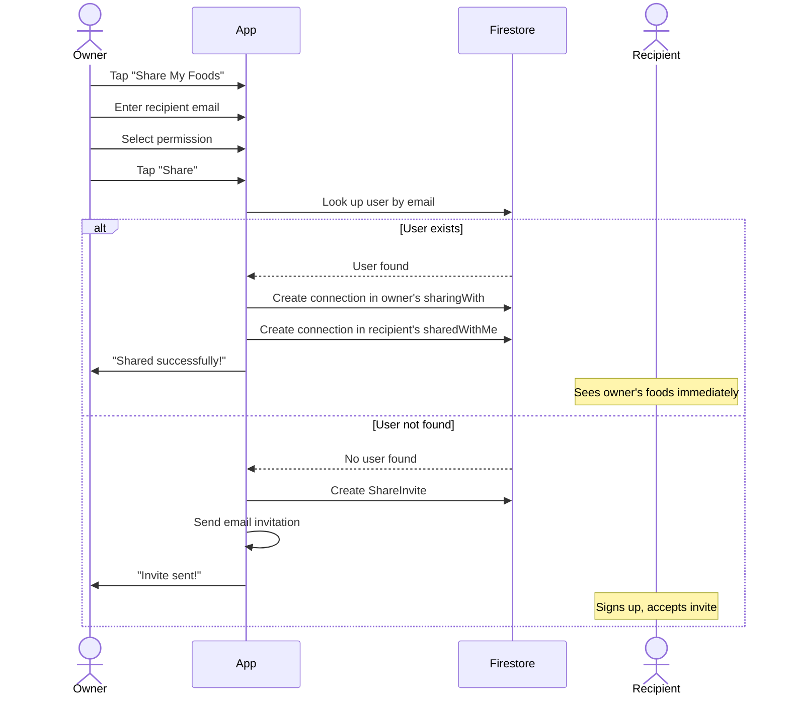
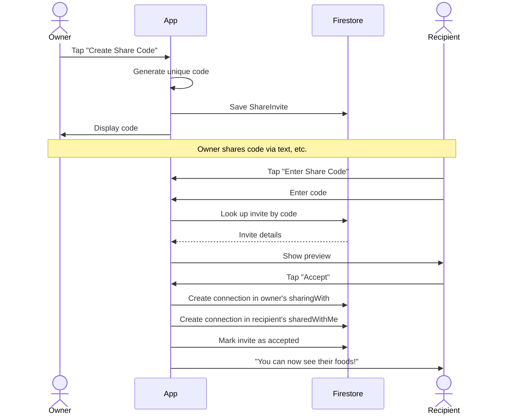
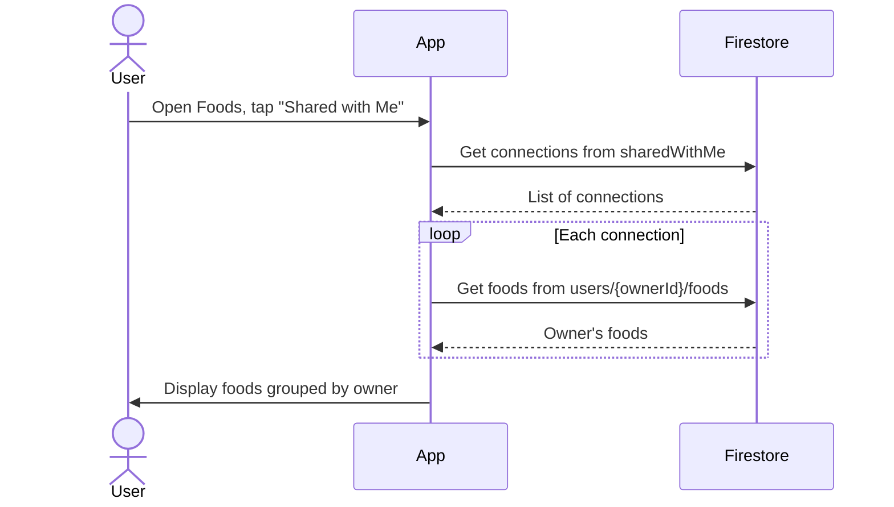
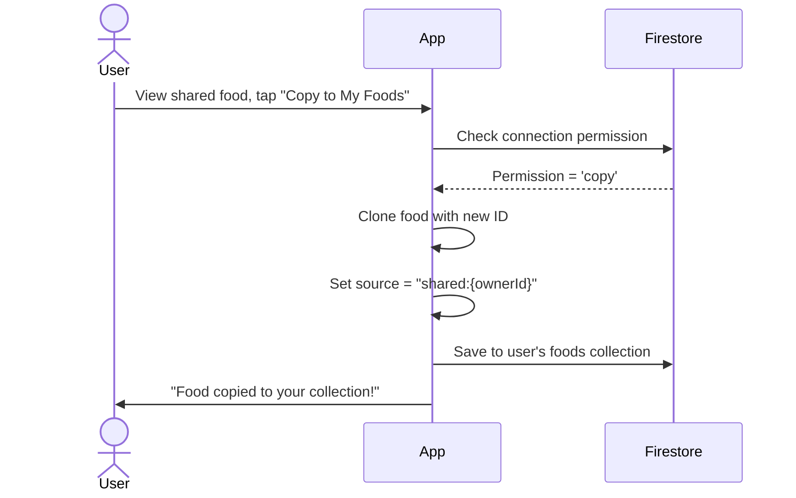

# Food Sharing Feature Design

This document describes a simplified food sharing feature that allows users to share their entire food library with other users.

## Overview

The food sharing feature enables users to:
1. **Grant Access** - Allow specific users to view all foods they've created
2. **Receive Access** - Browse foods from users who have shared with them
3. **Copy Foods** - Clone shared foods to their own collection
4. **Manage Connections** - View and revoke sharing relationships

## Core Concept

Instead of sharing individual foods, users share their **entire food library** with trusted connections. This simplifies the mental model:

- "I share my foods with Sarah" (not "I share chicken breast with Sarah")
- One action grants access to all current and future foods
- Easy to manage - just a list of people you share with

## Data Models

### FoodSharingConnection

Represents a one-way sharing relationship between two users.

```typescript
interface FoodSharingConnection {
  id: string;                      // Unique identifier
  ownerId: string;                 // User who is sharing their foods
  ownerEmail: string;              // Owner's email (for display)
  ownerDisplayName?: string;       // Owner's display name
  sharedWithUserId: string;        // User receiving access
  sharedWithEmail: string;         // Recipient's email
  sharedWithDisplayName?: string;  // Recipient's display name
  permission: 'view' | 'copy';     // Can they only view or also copy?
  status: 'active' | 'revoked';
  createdAt: Date;
  updatedAt: Date;
}
```

### ShareInvite

A code that can be shared to establish a connection with someone who may not have an account yet.

```typescript
interface ShareInvite {
  id: string;
  code: string;                    // 8-character invite code
  ownerId: string;
  ownerEmail: string;
  ownerDisplayName?: string;
  permission: 'view' | 'copy';
  status: 'pending' | 'accepted' | 'expired' | 'revoked';
  acceptedByUserId?: string;       // Who accepted (if accepted)
  createdAt: Date;
  expiresAt: Date;                 // Default: 7 days
}
```

## Firestore Collection Structure

```
firestore/
├── users/
│   └── {userId}/
│       ├── foods/{foodId}                    # User's own foods
│       ├── sharingWith/{connectionId}        # People I share with (outgoing)
│       └── sharedWithMe/{connectionId}       # People sharing with me (incoming)
│
└── shareInvites/{code}                       # Global invite codes
```

### Collection Details

| Collection | Path | Description |
|------------|------|-------------|
| User's Foods | `users/{userId}/foods` | User's own food items |
| Sharing With | `users/{userId}/sharingWith` | Connections where user is the owner |
| Shared With Me | `users/{userId}/sharedWithMe` | Connections where user is the recipient |
| Invites | `shareInvites/{code}` | Global invite codes for lookup |

### Why Denormalize Connections?

We store connections in both users' subcollections:
- **Owner's side** (`sharingWith`): "Who am I sharing with?"
- **Recipient's side** (`sharedWithMe`): "Who is sharing with me?"

This allows efficient queries without collection group queries or cloud functions.

## User Interface Design

### 1. Sharing Settings Screen

Access from Profile → "Food Sharing" or Settings.

```
┌────────────────────────────────────────┐
│ ← Food Sharing                         │
├────────────────────────────────────────┤
│                                        │
│  PEOPLE I SHARE WITH                   │
│  These people can see all your foods   │
│  ┌────────────────────────────────────┐│
│  │ 👤 Sarah Johnson                   ││
│  │    sarah@example.com               ││
│  │    Can view & copy • Since Jan 15  ││
│  │                     [Stop Sharing] ││
│  ├────────────────────────────────────┤│
│  │ 👤 John Smith                      ││
│  │    john@example.com                ││
│  │    Can view only • Since Jan 20    ││
│  │                     [Stop Sharing] ││
│  └────────────────────────────────────┘│
│                                        │
│  [ + Share My Foods with Someone ]     │
│                                        │
│  ─────────────────────────────────────│
│                                        │
│  PEOPLE SHARING WITH ME                │
│  You can see all their foods           │
│  ┌────────────────────────────────────┐│
│  │ 👤 Mike Wilson                     ││
│  │    mike@example.com                ││
│  │    12 foods • Can copy             ││
│  │    [View Foods]      [Leave]       ││
│  └────────────────────────────────────┘│
│                                        │
│  [ + Enter Share Code ]                │
│                                        │
└────────────────────────────────────────┘
```

### 2. Share My Foods Modal

```
┌────────────────────────────────────────┐
│ Share My Foods                      ✕  │
├────────────────────────────────────────┤
│                                        │
│  Share via email:                      │
│  ┌────────────────────────────────────┐│
│  │ friend@example.com                 ││
│  └────────────────────────────────────┘│
│                                        │
│  Permission:                           │
│  ○ View only                           │
│  ● View & Copy                         │
│                                        │
│  [     Share     ]                     │
│                                        │
│  ─────────── OR ───────────            │
│                                        │
│  [ Create Share Code ]                 │
│                                        │
│  Share codes let you share via text,   │
│  messaging apps, or with someone who   │
│  doesn't have an account yet.          │
│                                        │
└────────────────────────────────────────┘
```

### 3. Share Code Created Modal

```
┌────────────────────────────────────────┐
│ Share Code Created                  ✕  │
├────────────────────────────────────────┤
│                                        │
│  Give this code to someone to let      │
│  them access all your foods:           │
│                                        │
│  ┌────────────────────────────────────┐│
│  │                                    ││
│  │         ABCD-1234                  ││
│  │                                    ││
│  └────────────────────────────────────┘│
│                                        │
│  [ 📋 Copy ]     [ 📤 Share ]          │
│                                        │
│  ⏱ Expires in 7 days                   │
│  🔒 Can be used once                   │
│                                        │
│  [     Done     ]                      │
│                                        │
└────────────────────────────────────────┘
```

### 4. Enter Share Code Modal

```
┌────────────────────────────────────────┐
│ Enter Share Code                    ✕  │
├────────────────────────────────────────┤
│                                        │
│  Enter the code someone shared with    │
│  you to see their foods:               │
│                                        │
│  ┌────────────────────────────────────┐│
│  │         ABCD-1234                  ││
│  └────────────────────────────────────┘│
│                                        │
│  ┌────────────────────────────────────┐│
│  │ ✓ Valid code from:                 ││
│  │   Sarah Johnson (sarah@email.com)  ││
│  │   Permission: View & Copy          ││
│  └────────────────────────────────────┘│
│                                        │
│  [     Accept     ]                    │
│                                        │
└────────────────────────────────────────┘
```

### 5. Foods List - Shared Tab

```
┌────────────────────────────────────────┐
│  Foods                             ⚙️  │
├────────────────────────────────────────┤
│  [ My Foods ]  [ Shared with Me ]      │
│                 ─────────────────      │
├────────────────────────────────────────┤
│  🔍 Search shared foods...             │
├────────────────────────────────────────┤
│                                        │
│  FROM SARAH JOHNSON                    │
│  ┌────────────────────────────────────┐│
│  │ 🍗 Grilled Chicken Breast          ││
│  │    165 cal • 31g protein           ││
│  ├────────────────────────────────────┤│
│  │ 🥗 Mediterranean Salad             ││
│  │    220 cal • 8g protein            ││
│  ├────────────────────────────────────┤│
│  │ 🍚 Brown Rice (cooked)             ││
│  │    215 cal • 5g protein            ││
│  └────────────────────────────────────┘│
│                                        │
│  FROM MIKE WILSON                      │
│  ┌────────────────────────────────────┐│
│  │ 🥤 Protein Smoothie                ││
│  │    280 cal • 30g protein           ││
│  └────────────────────────────────────┘│
│                                        │
└────────────────────────────────────────┘
```

### 6. Shared Food Detail (Read-only with Copy option)

```
┌────────────────────────────────────────┐
│ ←  Grilled Chicken Breast              │
│     Shared by Sarah Johnson            │
├────────────────────────────────────────┤
│                                        │
│  Serving: 100g                         │
│  ─────────────────────────────────────│
│  Calories    165 cal                   │
│  Protein     31g                       │
│  Carbs       0g                        │
│  Fat         3.6g                      │
│  ─────────────────────────────────────│
│                                        │
│  [ Add to Meal ]  [ Copy to My Foods ] │
│                                        │
└────────────────────────────────────────┘
```

## User Flows

### Flow 1: Share via Email



### Flow 2: Share via Code



### Flow 3: Viewing Shared Foods



### Flow 4: Copying a Shared Food



## Repository Interface

```typescript
interface IFoodSharingRepository {
  // === Managing who I share with ===
  
  /**
   * Share my foods with another user by email
   */
  shareWithUser(email: string, permission: 'view' | 'copy'): Promise<ShareResult>;
  
  /**
   * Create a share code for someone to connect with me
   */
  createShareCode(permission: 'view' | 'copy'): Promise<ShareInvite>;
  
  /**
   * Get list of users I'm sharing my foods with
   */
  getSharingWith(): Promise<FoodSharingConnection[]>;
  
  /**
   * Stop sharing my foods with a user
   */
  stopSharingWith(connectionId: string): Promise<void>;
  
  /**
   * Revoke a share code
   */
  revokeShareCode(inviteId: string): Promise<void>;
  
  // === Managing who shares with me ===
  
  /**
   * Get list of users sharing their foods with me
   */
  getSharedWithMe(): Promise<FoodSharingConnection[]>;
  
  /**
   * Accept a share code from another user
   */
  acceptShareCode(code: string): Promise<AcceptResult>;
  
  /**
   * Preview a share code before accepting
   */
  previewShareCode(code: string): Promise<ShareCodePreview | null>;
  
  /**
   * Leave a sharing connection (stop seeing their foods)
   */
  leaveConnection(connectionId: string): Promise<void>;
  
  // === Accessing shared foods ===
  
  /**
   * Get all foods from users sharing with me
   */
  getSharedFoods(): Promise<SharedFood[]>;
  
  /**
   * Get foods from a specific user sharing with me
   */
  getFoodsFromUser(ownerId: string): Promise<FoodItem[]>;
  
  /**
   * Copy a shared food to my collection
   */
  copyFood(ownerId: string, foodId: string, newName?: string): Promise<FoodItem>;
}

interface ShareResult {
  success: boolean;
  connectionId?: string;
  inviteId?: string;  // If user doesn't exist yet
  error?: string;
}

interface AcceptResult {
  success: boolean;
  connectionId?: string;
  ownerName?: string;
  foodCount?: number;
  error?: string;
}

interface ShareCodePreview {
  ownerDisplayName: string;
  ownerEmail: string;
  permission: 'view' | 'copy';
  foodCount: number;
  expiresAt: Date;
}

interface SharedFood extends FoodItem {
  ownerId: string;
  ownerDisplayName?: string;
  ownerEmail?: string;
  canCopy: boolean;
}
```

## Firebase Security Rules

```javascript
rules_version = '2';
service cloud.firestore {
  match /databases/{database}/documents {
    
    function isAuthenticated() {
      return request.auth != null;
    }
    
    function isOwner(userId) {
      return isAuthenticated() && request.auth.uid == userId;
    }
    
    // User document and subcollections
    match /users/{userId} {
      allow read, write: if isOwner(userId);
      
      // User's own foods - owner can do anything
      // Others can read if they have a sharing connection
      match /foods/{foodId} {
        allow read, write: if isOwner(userId);
        
        // Allow read if there's an active sharing connection
        allow read: if isAuthenticated() && 
          exists(/databases/$(database)/documents/users/$(request.auth.uid)/sharedWithMe/$(userId));
      }
      
      // Sharing connections I've created
      match /sharingWith/{connectionId} {
        allow read, write: if isOwner(userId);
      }
      
      // Connections from people sharing with me
      match /sharedWithMe/{connectionId} {
        // I can read my incoming connections
        allow read: if isOwner(userId);
        
        // The owner of the connection can create/update it
        allow create, update: if isAuthenticated() && 
          request.resource.data.ownerId == request.auth.uid;
        
        // I can delete (leave) or owner can delete (revoke)
        allow delete: if isOwner(userId) || 
          (isAuthenticated() && resource.data.ownerId == request.auth.uid);
      }
    }
    
    // Global share invites
    match /shareInvites/{code} {
      // Anyone can read to check/preview a code
      allow read: if isAuthenticated();
      
      // Only owner can create
      allow create: if isAuthenticated() && 
        request.resource.data.ownerId == request.auth.uid;
      
      // Owner can update/delete, or recipient can mark as accepted
      allow update: if isAuthenticated() && (
        resource.data.ownerId == request.auth.uid ||
        (
          resource.data.status == 'pending' &&
          request.resource.data.status == 'accepted' &&
          request.resource.data.acceptedByUserId == request.auth.uid
        )
      );
      
      allow delete: if isAuthenticated() && 
        resource.data.ownerId == request.auth.uid;
    }
  }
}
```

## Implementation Notes

### Reading Shared Foods

When a user views "Shared with Me", the app:

1. Reads `users/{myUserId}/sharedWithMe` to get list of connections
2. For each connection, reads `users/{ownerId}/foods` (allowed by security rules)
3. Groups and displays foods by owner

```typescript
async function getSharedFoods(): Promise<SharedFood[]> {
  const connections = await getSharedWithMe();
  const allFoods: SharedFood[] = [];
  
  for (const connection of connections) {
    const foods = await firestore
      .collection(`users/${connection.ownerId}/foods`)
      .get();
    
    for (const doc of foods.docs) {
      allFoods.push({
        ...doc.data(),
        id: doc.id,
        ownerId: connection.ownerId,
        ownerDisplayName: connection.ownerDisplayName,
        ownerEmail: connection.ownerEmail,
        canCopy: connection.permission === 'copy',
      });
    }
  }
  
  return allFoods;
}
```

### Creating a Connection

When User A shares with User B:

```typescript
async function shareWithUser(email: string, permission: Permission) {
  // 1. Find user B by email
  const userB = await findUserByEmail(email);
  if (!userB) {
    return createShareCode(permission); // Create invite instead
  }
  
  const connection: FoodSharingConnection = {
    id: generateId(),
    ownerId: currentUserId,
    ownerEmail: currentUserEmail,
    ownerDisplayName: currentUserDisplayName,
    sharedWithUserId: userB.id,
    sharedWithEmail: email,
    sharedWithDisplayName: userB.displayName,
    permission,
    status: 'active',
    createdAt: new Date(),
    updatedAt: new Date(),
  };
  
  // 2. Write to both users' subcollections
  await Promise.all([
    // Owner's outgoing list
    firestore.doc(`users/${currentUserId}/sharingWith/${connection.id}`)
      .set(connection),
    // Recipient's incoming list
    firestore.doc(`users/${userB.id}/sharedWithMe/${connection.id}`)
      .set(connection),
  ]);
  
  return { success: true, connectionId: connection.id };
}
```

### Revoking Access

When owner stops sharing:

```typescript
async function stopSharingWith(connectionId: string) {
  // Get connection to find recipient
  const connection = await firestore
    .doc(`users/${currentUserId}/sharingWith/${connectionId}`)
    .get();
  
  const recipientId = connection.data().sharedWithUserId;
  
  // Delete from both places
  await Promise.all([
    firestore.doc(`users/${currentUserId}/sharingWith/${connectionId}`).delete(),
    firestore.doc(`users/${recipientId}/sharedWithMe/${connectionId}`).delete(),
  ]);
}
```

## Data Relationships

```
UserProfile
  ├── has many Foods
  ├── has many FoodSharingConnections (as owner, via sharingWith)
  ├── has many FoodSharingConnections (as recipient, via sharedWithMe)
  └── has many ShareInvites

FoodSharingConnection
  ├── belongs to UserProfile (owner)
  ├── belongs to UserProfile (recipient)
  └── grants access to owner's Foods

ShareInvite
  ├── belongs to UserProfile (owner)
  └── creates FoodSharingConnection when accepted
```

## Summary

This simplified design:

1. **Shares all foods** - One action shares your entire library
2. **Simple relationships** - Just track who shares with who
3. **Two-way storage** - Connections stored in both users' subcollections for easy queries
4. **Flexible access** - Share via email or share codes
5. **Clear permissions** - View-only or view-and-copy
6. **Easy to manage** - Simple list of connections to add/remove

## Related Documentation

- [Data Models](./data-models.md) - Core entity definitions
- [Recipes Design](./recipes-design.md) - Similar sharing could apply to recipes
- [User Stories: Social](./user-stories/social.md) - Social feature user stories
