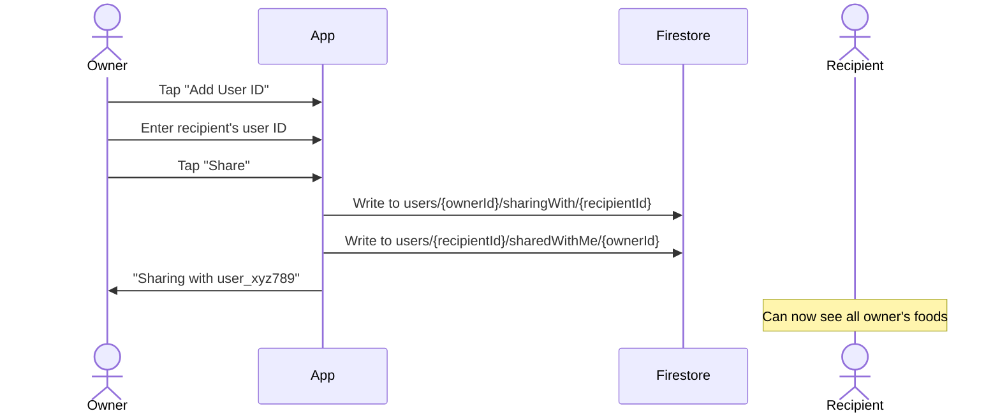
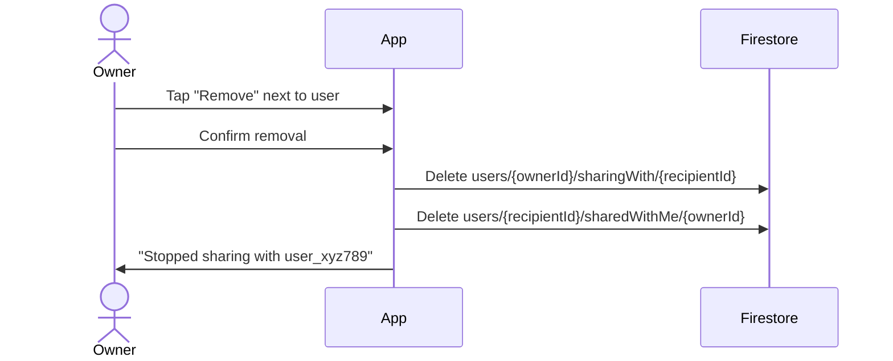
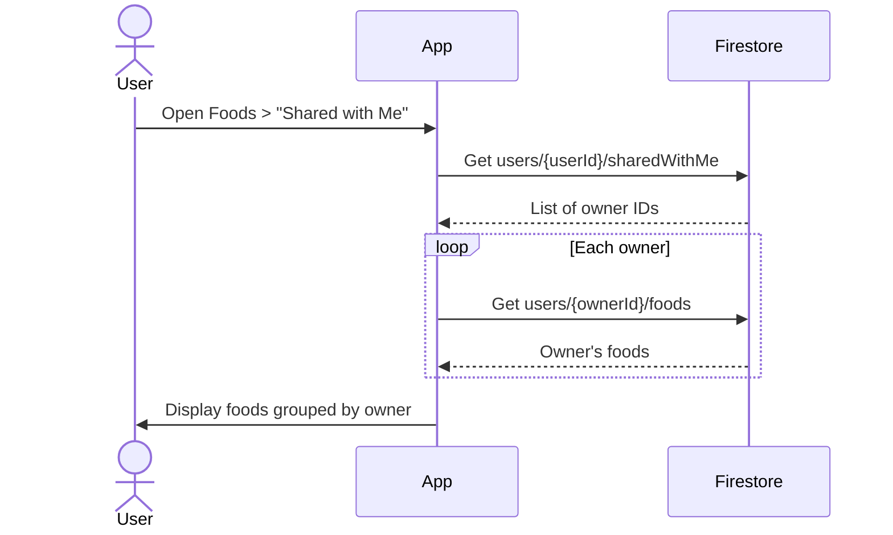
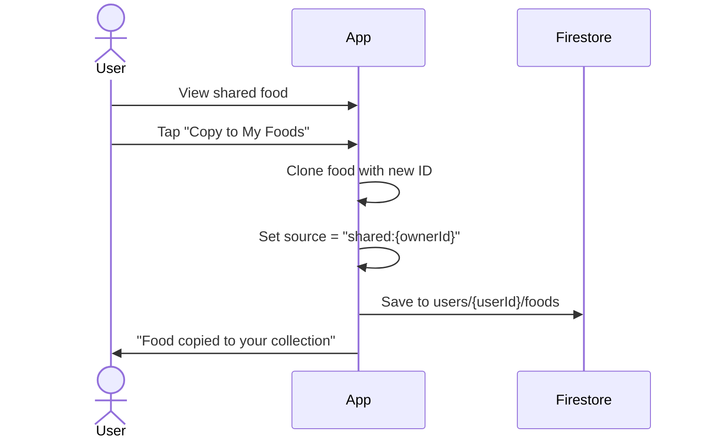

# Food Sharing Feature Design

This document describes a simple food sharing feature that allows users to share their entire food library with other users.

## Overview

Users can share all their custom foods with other users by adding their user ID. Recipients can view and copy any shared food to their own collection.

## Core Concept

- **Share by User ID** - Add someone's user ID to share all your foods with them
- **Instant access** - Sharing and revoking takes effect immediately
- **Full access** - Recipients can view all foods and copy any to their collection
- **One-way relationship** - Sharing is directional (A shares with B doesn't mean B shares with A)

## Data Model

### FoodSharingConnection

A simple record of who shares with who.

```typescript
interface FoodSharingConnection {
  odwnerId: string;               // User sharing their foods
  recipientId: string;            // User receiving access
  createdAt: Date;
}
```

That's it. No permissions, no invites, no status fields.

## Firestore Structure

```
users/{userId}/
├── foods/{foodId}                    # User's foods
├── sharingWith/{recipientId}         # Users I share with (document ID = recipientId visually allows duplicate protection in Firestore)
└── sharedWithMe/{ownerId}            # Users sharing with me (document ID = ownerId)
```

### Collection Details

| Collection | Path | Document ID | Description |
|------------|------|-------------|-------------|
| My Foods | `users/{userId}/foods` | foodId | User's own foods |
| Sharing With | `users/{userId}/sharingWith` | recipientId | People I share my foods with |
| Shared With Me | `users/{userId}/sharedWithMe` | ownerId | People sharing their foods with me |

### Why Use User ID as Document ID?

Using the target user's ID as the document ID:
- Prevents duplicate connections (Firestore enforces unique doc IDs)
- Enables direct lookups without queries
- Simplifies checking if a connection exists

## User Interface

### 1. Food Sharing Settings

Access from Profile or Settings.

```
┌────────────────────────────────────────┐
│ ← Food Sharing                         │
├────────────────────────────────────────┤
│                                        │
│  SHARING MY FOODS WITH                 │
│  ┌────────────────────────────────────┐│
│  │ user_abc123                        ││
│  │ Added Jan 15          [Remove]     ││
│  ├────────────────────────────────────┤│
│  │ user_def456                        ││
│  │ Added Jan 20          [Remove]     ││
│  └────────────────────────────────────┘│
│                                        │
│  [ + Add User ID ]                     │
│                                        │
│  ─────────────────────────────────────│
│                                        │
│  PEOPLE SHARING WITH ME                │
│  ┌────────────────────────────────────┐│
│  │ user_xyz789                        ││
│  │ 8 foods         [View] [Leave]     ││
│  └────────────────────────────────────┘│
│                                        │
│  ─────────────────────────────────────│
│                                        │
│  MY USER ID                            │
│  ┌────────────────────────────────────┐│
│  │ user_myid123        [Copy]         ││
│  └────────────────────────────────────┘│
│  Share this ID with others so they     │
│  can share their foods with you.       │
│                                        │
└────────────────────────────────────────┘
```

### 2. Add User ID Modal

```
┌────────────────────────────────────────┐
│ Share My Foods                      ✕  │
├────────────────────────────────────────┤
│                                        │
│  Enter the user ID of the person you   │
│  want to share your foods with:        │
│                                        │
│  ┌────────────────────────────────────┐│
│  │ user_abc123                        ││
│  └────────────────────────────────────┘│
│                                        │
│  They will be able to see all your     │
│  foods and copy them to their own      │
│  collection.                           │
│                                        │
│  [       Share       ]                 │
│                                        │
└────────────────────────────────────────┘
```

### 3. Foods List - Shared Tab

```
┌────────────────────────────────────────┐
│  Foods                                 │
├────────────────────────────────────────┤
│  [ My Foods ]  [ Shared with Me ]      │
│                 ─────────────────      │
├────────────────────────────────────────┤
│  🔍 Search shared foods...             │
├────────────────────────────────────────┤
│                                        │
│  FROM user_xyz789                      │
│  ┌────────────────────────────────────┐│
│  │ 🍗 Grilled Chicken Breast          ││
│  │    165 cal • 31g protein           ││
│  ├────────────────────────────────────┤│
│  │ 🥗 Mediterranean Salad             ││
│  │    220 cal • 8g protein            ││
│  └────────────────────────────────────┘│
│                                        │
│  FROM user_abc456                      │
│  ┌────────────────────────────────────┐│
│  │ 🥤 Protein Smoothie                ││
│  │    280 cal • 30g protein           ││
│  └────────────────────────────────────┘│
│                                        │
└────────────────────────────────────────┘
```

### 4. Shared Food Detail

```
┌────────────────────────────────────────┐
│ ←  Grilled Chicken Breast              │
│     Shared by user_xyz789              │
├────────────────────────────────────────┤
│                                        │
│  Serving: 100g                         │
│  ─────────────────────────────────────│
│  Calories    165 cal                   │
│  Protein     31g                       │
│  Carbs       0g                        │
│  Fat         3.6g                      │
│  ─────────────────────────────────────│
│                                        │
│  [ Add to Meal ]  [ Copy to My Foods ] │
│                                        │
└────────────────────────────────────────┘
```

## User Flows

### Share with a User



### Revoke Sharing



### View Shared Foods



### Copy a Shared Food



## Repository Interface

```typescript
interface IFoodSharingRepository {
  /**
   * Share my foods with a user
   */
  shareWith(recipientId: string): Promise<void>;
  
  /**
   * Stop sharing my foods with a user
   */
  stopSharingWith(recipientId: string): Promise<void>;
  
  /**
   * Get list of user IDs I'm sharing with
   */
  getSharingWith(): Promise<string[]>;
  
  /**
   * Get list of user IDs sharing with me
   */
  getSharedWithMe(): Promise<string[]>;
  
  /**
   * Leave a sharing connection (stop seeing their foods)
   */
  leaveSharing(ownerId: string): Promise<void>;
  
  /**
   * Get all foods from users sharing with me
   */
  getSharedFoods(): Promise<SharedFood[]>;
  
  /**
   * Get foods from a specific user
   */
  getFoodsFrom(ownerId: string): Promise<FoodItem[]>;
  
  /**
   * Copy a shared food to my collection
   */
  copyFood(ownerId: string, foodId: string): Promise<FoodItem>;
}

interface SharedFood extends FoodItem {
  ownerId: string;
}
```

## Firebase Security Rules

```javascript
rules_version = '2';
service cloud.firestore {
  match /databases/{database}/documents {
    
    function isAuthenticated() {
      return request.auth != null;
    }
    
    function isOwner(userId) {
      return isAuthenticated() && request.auth.uid == userId;
    }
    
    match /users/{userId} {
      allow read, write: if isOwner(userId);
      
      // User's foods
      match /foods/{foodId} {
        // Owner has full access
        allow read, write: if isOwner(userId);
        
        // Others can read if they have a sharing connection
        allow read: if isAuthenticated() && 
          exists(/databases/$(database)/documents/users/$(request.auth.uid)/sharedWithMe/$(userId));
      }
      
      // Who I share with
      match /sharingWith/{recipientId} {
        allow read, write: if isOwner(userId);
      }
      
      // Who shares with me
      match /sharedWithMe/{ownerId} {
        // I can read and delete my incoming connections
        allow read, delete: if isOwner(userId);
        
        // The owner can create/delete this document
        allow create, delete: if isOwner(ownerId);
      }
    }
  }
}
```

## Implementation

### Share with a User

```typescript
async function shareWith(recipientId: string): Promise<void> {
  const myId = getCurrentUserId();
  
  const connection = {
    ownerId: myId,
    recipientId: recipientId,
    createdAt: new Date(),
  };
  
  // Write to both collections
  await Promise.all([
    firestore.doc(`users/${myId}/sharingWith/${recipientId}`).set(connection),
    firestore.doc(`users/${recipientId}/sharedWithMe/${myId}`).set(connection),
  ]);
}
```

### Stop Sharing

```typescript
async function stopSharingWith(recipientId: string): Promise<void> {
  const myId = getCurrentUserId();
  
  await Promise.all([
    firestore.doc(`users/${myId}/sharingWith/${recipientId}`).delete(),
    firestore.doc(`users/${recipientId}/sharedWithMe/${myId}`).delete(),
  ]);
}
```

### Get Shared Foods

```typescript
async function getSharedFoods(): Promise<SharedFood[]> {
  const myId = getCurrentUserId();
  
  // Get list of people sharing with me
  const connections = await firestore
    .collection(`users/${myId}/sharedWithMe`)
    .get();
  
  const allFoods: SharedFood[] = [];
  
  // Get foods from each person
  for (const doc of connections.docs) {
    const ownerId = doc.id;
    const foods = await firestore
      .collection(`users/${ownerId}/foods`)
      .get();
    
    for (const foodDoc of foods.docs) {
      allFoods.push({
        ...foodDoc.data(),
        id: foodDoc.id,
        ownerId,
      });
    }
  }
  
  return allFoods;
}
```

### Copy a Food

```typescript
async function copyFood(ownerId: string, foodId: string): Promise<FoodItem> {
  const myId = getCurrentUserId();
  
  // Get the original food
  const foodDoc = await firestore
    .doc(`users/${ownerId}/foods/${foodId}`)
    .get();
  
  if (!foodDoc.exists) {
    throw new Error('Food not found');
  }
  
  const originalFood = foodDoc.data() as FoodItem;
  
  // Create a copy
  const newFood: FoodItem = {
    ...originalFood,
    id: generateId(),
    source: `shared:${ownerId}`,
    createdAt: new Date(),
    updatedAt: new Date(),
  };
  
  // Save to my collection
  await firestore
    .doc(`users/${myId}/foods/${newFood.id}`)
    .set(newFood);
  
  return newFood;
}
```

## Data Model Summary

```
FoodSharingConnection
  ├── ownerId (who is sharing)
  ├── recipientId (who can access)
  └── createdAt

Storage:
  users/{ownerId}/sharingWith/{recipientId}     → I share with them
  users/{recipientId}/sharedWithMe/{ownerId}   → They share with me
```

## Related Documentation

- [Data Models](./data-models.md) - Core entity definitions
- [Recipes Design](./recipes-design.md) - Recipe system design
