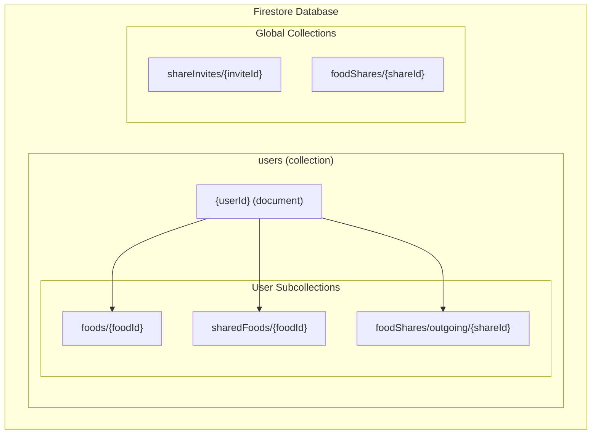
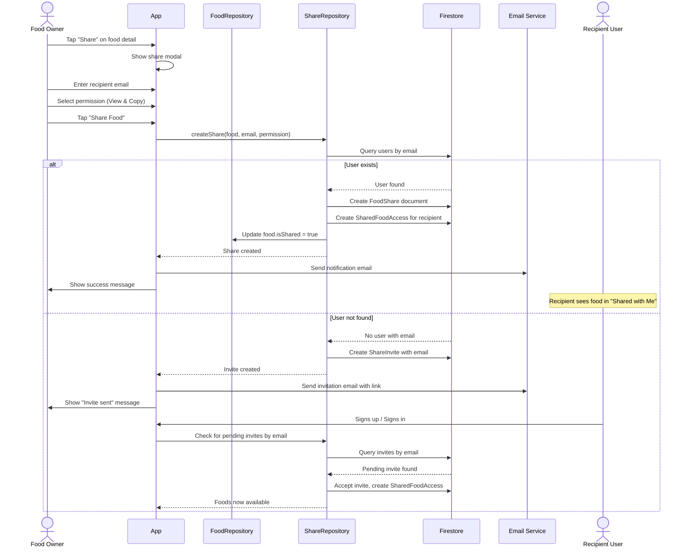
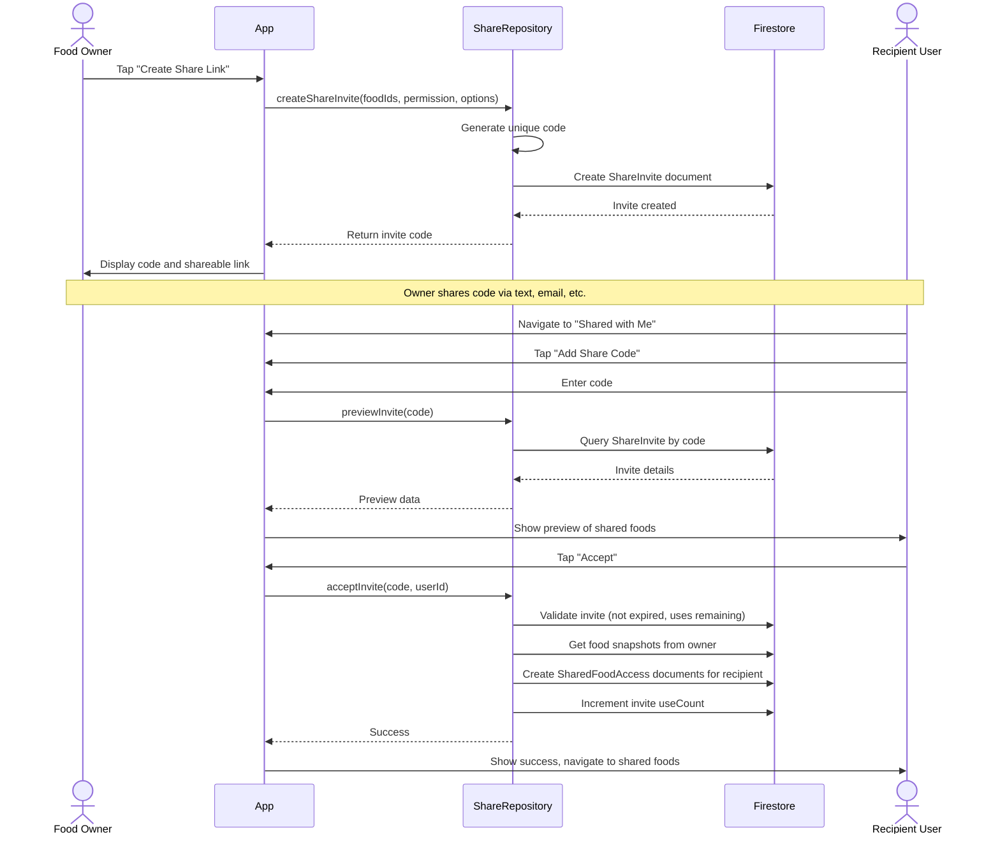
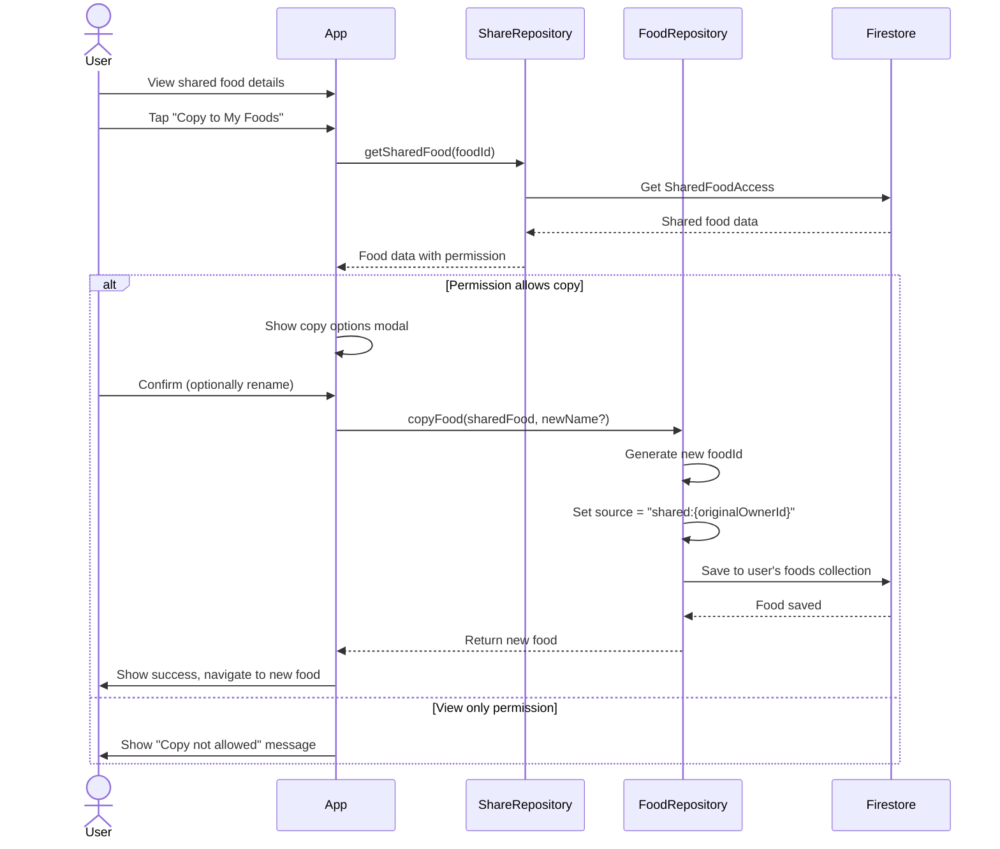
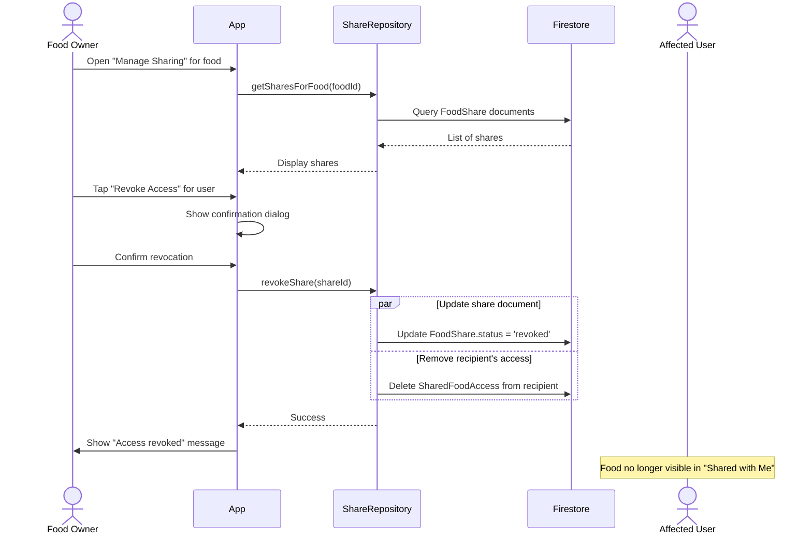
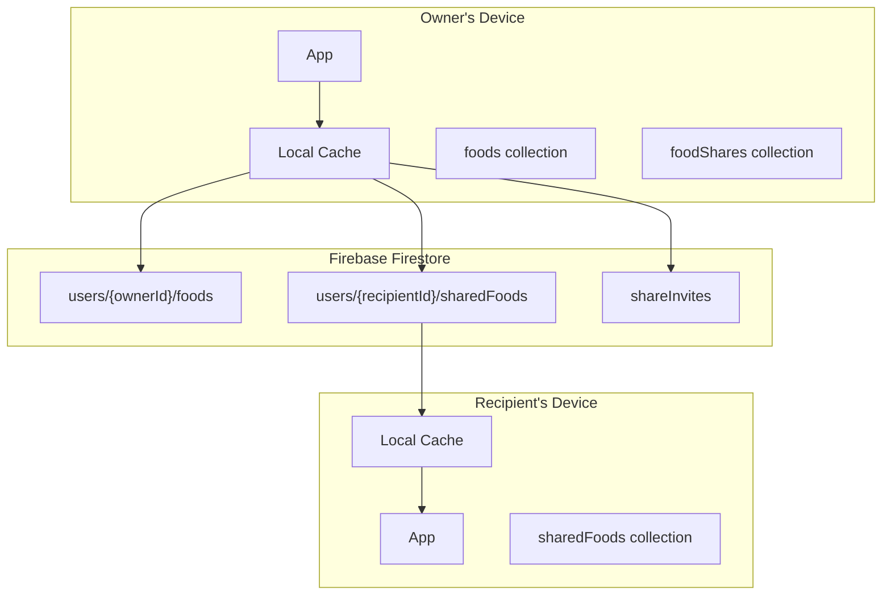
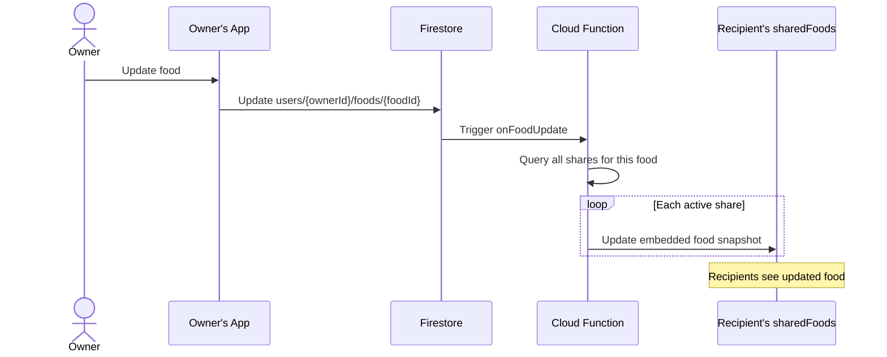
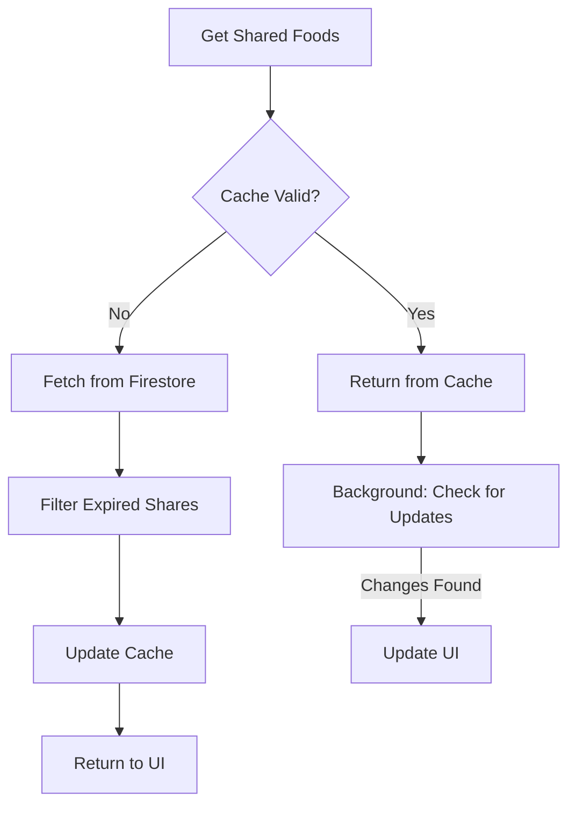

# Food Sharing Feature Design

This document provides a comprehensive design for the food sharing feature, which allows users to share their custom food items with other users. The design covers UI components, backend data structures, Firebase permissions, and the repository architecture.

## Overview

The food sharing feature enables users to:
1. **Share Foods** - Allow specific users to view foods they've created
2. **Manage Access** - Grant and revoke access to shared foods
3. **Browse Shared Foods** - View foods that others have shared with them
4. **Copy Shared Foods** - Clone shared foods to their own collection

## Use Cases

### Primary Use Cases

| Use Case | Description |
|----------|-------------|
| UC-1 | User shares their custom foods with a family member |
| UC-2 | User shares foods with a nutrition coach or dietitian |
| UC-3 | User grants temporary access to a friend trying a new diet |
| UC-4 | User copies a shared food to customize it for themselves |
| UC-5 | User revokes access when sharing is no longer needed |

## Data Models

### New Entities

#### FoodShare
Represents a sharing permission granted to another user for a food item.

```typescript
interface FoodShare {
  id: string;                    // Unique identifier
  foodId: string;                // Reference to the food being shared
  ownerId: string;               // User ID of the food owner
  sharedWithUserId: string;      // User ID of the recipient
  sharedWithEmail?: string;      // Email used for sharing (for display)
  permission: 'view' | 'copy';   // Permission level
  status: 'pending' | 'active' | 'revoked';
  createdAt: Date;
  updatedAt: Date;
  expiresAt?: Date;              // Optional expiration date
  note?: string;                 // Optional note from the sharer
}
```

#### ShareInvite
Represents a pending invitation for a user who may not have an account yet.

```typescript
interface ShareInvite {
  id: string;                    // Unique identifier
  code: string;                  // Unique invite code (6-8 alphanumeric)
  ownerId: string;               // User ID of the inviter
  ownerEmail?: string;           // Email of the inviter (for display)
  ownerDisplayName?: string;     // Display name of the inviter
  foodIds: string[];             // Foods included in the invite
  permission: 'view' | 'copy';   // Permission level
  status: 'pending' | 'accepted' | 'expired' | 'revoked';
  maxUses: number;               // Maximum number of times the invite can be used
  useCount: number;              // Current use count
  usedBy: string[];              // User IDs who have used this invite
  createdAt: Date;
  expiresAt: Date;               // When the invite expires
}
```

#### SharedFoodAccess
Denormalized view stored in each user's subcollection for efficient querying.

```typescript
interface SharedFoodAccess {
  id: string;                    // Same as foodId for direct lookup
  foodId: string;                // Reference to the shared food
  ownerId: string;               // User ID of the food owner
  ownerEmail?: string;           // Owner's email (for display)
  ownerDisplayName?: string;     // Owner's display name
  food: FoodItem;                // Embedded snapshot of the food
  permission: 'view' | 'copy';
  sharedAt: Date;
  expiresAt?: Date;
}
```

### Extended FoodItem

The existing `FoodItem` type is extended with sharing metadata:

```typescript
interface FoodItem {
  // ... existing fields ...
  
  // Sharing metadata (only on owner's copy)
  isShared?: boolean;            // Whether this food is shared with anyone
  shareCount?: number;           // Number of users this food is shared with
}
```

## Firestore Collection Structure



### Collection Paths

| Collection | Path | Document ID | Description |
|------------|------|-------------|-------------|
| User Foods | `users/{userId}/foods/{foodId}` | UUID | User's own food items |
| Shared Foods (Incoming) | `users/{userId}/sharedFoods/{foodId}` | foodId | Foods shared with this user |
| Food Shares (Outgoing) | `users/{userId}/foodShares/{shareId}` | UUID | Shares this user has created |
| Share Invites | `shareInvites/{code}` | Invite code | Global invite codes |
| Food Shares (Global Index) | `foodShares/{shareId}` | UUID | Global share index for queries |

## User Interface Design

### 1. Food Detail Screen - Share Button

Add a share button to the existing food detail screen for owned foods.

```
┌────────────────────────────────────────┐
│ ←  Chicken Breast (Grilled)            │
├────────────────────────────────────────┤
│                                        │
│  [Food image or icon]                  │
│                                        │
│  Serving: 100g                         │
│  ─────────────────────────────────────│
│  Calories    165 cal                   │
│  Protein     31g                       │
│  Carbs       0g                        │
│  Fat         3.6g                      │
│  ─────────────────────────────────────│
│                                        │
│  [  Edit  ]    [  Share  ]   [Delete]  │
│                                        │
│  ─────────────────────────────────────│
│  Shared with 2 people                  │
│  [Manage Sharing →]                    │
│                                        │
└────────────────────────────────────────┘
```

### 2. Share Food Modal

Modal that appears when the user taps "Share".

```
┌────────────────────────────────────────┐
│ Share "Chicken Breast (Grilled)"    ✕  │
├────────────────────────────────────────┤
│                                        │
│  Share via:                            │
│  ┌────────────────────────────────────┐│
│  │ 📧 Email or Username               ││
│  │ __________________________________ ││
│  │ [user@example.com              ]   ││
│  └────────────────────────────────────┘│
│                                        │
│  ── OR ──                              │
│                                        │
│  ┌────────────────────────────────────┐│
│  │ 🔗 Create Share Link               ││
│  │ Generate a link that anyone can    ││
│  │ use to access this food            ││
│  │ [ Create Link ]                    ││
│  └────────────────────────────────────┘│
│                                        │
│  Permission:                           │
│  ○ View only - Can view nutrition info │
│  ● View & Copy - Can copy to their    │
│    own collection                      │
│                                        │
│  ☐ Set expiration date                 │
│    [30 days from now         ▼]        │
│                                        │
│  Note (optional):                      │
│  ┌────────────────────────────────────┐│
│  │ Here's the chicken I mentioned!   ││
│  └────────────────────────────────────┘│
│                                        │
│  [      Share Food      ]              │
│                                        │
└────────────────────────────────────────┘
```

### 3. Share Link Generated Modal

After creating a share link.

```
┌────────────────────────────────────────┐
│ Share Link Created                  ✕  │
├────────────────────────────────────────┤
│                                        │
│  ┌────────────────────────────────────┐│
│  │ Share Code:                        ││
│  │ ┌──────────────────────────────┐  ││
│  │ │      ABC123XY                │  ││
│  │ └──────────────────────────────┘  ││
│  │                                    ││
│  │ Or share this link:                ││
│  │ macroplan.app/share/ABC123XY      ││
│  │                                    ││
│  │ [ 📋 Copy Code ] [ 📤 Share ]     ││
│  └────────────────────────────────────┘│
│                                        │
│  ⚠️  This link expires in 30 days     │
│     and can be used 5 times           │
│                                        │
│  [      Done      ]                    │
│                                        │
└────────────────────────────────────────┘
```

### 4. Manage Sharing Screen

Screen to view and manage all sharing for a food.

```
┌────────────────────────────────────────┐
│ ← Sharing: Chicken Breast (Grilled)    │
├────────────────────────────────────────┤
│                                        │
│  SHARED WITH                           │
│  ┌────────────────────────────────────┐│
│  │ 👤 john@example.com                ││
│  │    View & Copy • Shared Jan 15     ││
│  │    [ Revoke Access ]               ││
│  ├────────────────────────────────────┤│
│  │ 👤 sarah@example.com               ││
│  │    View only • Expires Feb 28      ││
│  │    [ Revoke Access ]               ││
│  └────────────────────────────────────┘│
│                                        │
│  ACTIVE SHARE LINKS                    │
│  ┌────────────────────────────────────┐│
│  │ 🔗 ABC123XY                        ││
│  │    2/5 uses • Expires Feb 14       ││
│  │    [ Copy Link ] [ Delete ]        ││
│  └────────────────────────────────────┘│
│                                        │
│  [ + Share with Someone New ]          │
│                                        │
└────────────────────────────────────────┘
```

### 5. Shared Foods Tab (in Food List)

Add a "Shared with Me" tab to the foods list.

```
┌────────────────────────────────────────┐
│  My Foods                          ⚙️  │
├────────────────────────────────────────┤
│  [ My Foods ] [ Shared with Me ]       │
│              ─────────────────         │
├────────────────────────────────────────┤
│  🔍 Search shared foods...             │
├────────────────────────────────────────┤
│                                        │
│  FROM JOHN DOE                         │
│  ┌────────────────────────────────────┐│
│  │ 🍗 Grilled Chicken Breast          ││
│  │    165 cal • 31g protein           ││
│  │    [ View ] [ Copy to My Foods ]   ││
│  ├────────────────────────────────────┤│
│  │ 🥗 Custom Protein Salad            ││
│  │    320 cal • 28g protein           ││
│  │    [ View ] [ Copy to My Foods ]   ││
│  └────────────────────────────────────┘│
│                                        │
│  FROM SARAH SMITH                      │
│  ┌────────────────────────────────────┐│
│  │ 🥤 Homemade Protein Shake          ││
│  │    280 cal • 35g protein           ││
│  │    [ View ]                        ││
│  └────────────────────────────────────┘│
│                                        │
│  ─────────────────────────────────────│
│  [ + Add Share Code ]                  │
│                                        │
└────────────────────────────────────────┘
```

### 6. Add Share Code Modal

Modal for entering a share code received from another user.

```
┌────────────────────────────────────────┐
│ Add Shared Foods                    ✕  │
├────────────────────────────────────────┤
│                                        │
│  Enter the share code you received:    │
│                                        │
│  ┌────────────────────────────────────┐│
│  │                                    ││
│  │    [ A ][ B ][ C ][ 1 ][ 2 ][ 3 ] ││
│  │    [ X ][ Y ]                      ││
│  │                                    ││
│  └────────────────────────────────────┘│
│                                        │
│  ─────────────────────────────────────│
│                                        │
│  Preview:                              │
│  ┌────────────────────────────────────┐│
│  │ Shared by: John Doe                ││
│  │ Foods: 2 items                     ││
│  │ • Grilled Chicken Breast           ││
│  │ • Custom Protein Salad             ││
│  │ Permission: View & Copy            ││
│  │ Expires: Feb 14, 2026              ││
│  └────────────────────────────────────┘│
│                                        │
│  [     Accept Shared Foods     ]       │
│                                        │
└────────────────────────────────────────┘
```

## User Flows

### Flow 1: Sharing a Food via Email



### Flow 2: Sharing via Share Code



### Flow 3: Copying a Shared Food



### Flow 4: Revoking Access



## Repository Architecture

### SharedFoodRepository Interface

```typescript
/**
 * Repository for managing food sharing operations
 */
interface ISharedFoodRepository {
  // === Sharing Operations (Owner) ===
  
  /**
   * Share a food with another user by email
   */
  shareFood(
    foodId: string,
    recipientEmail: string,
    options: ShareOptions
  ): Promise<ShareResult>;
  
  /**
   * Create a shareable invite code for foods
   */
  createInvite(
    foodIds: string[],
    options: InviteOptions
  ): Promise<ShareInvite>;
  
  /**
   * Get all shares created by the current user
   */
  getOutgoingShares(): Promise<FoodShare[]>;
  
  /**
   * Get shares for a specific food
   */
  getSharesForFood(foodId: string): Promise<FoodShare[]>;
  
  /**
   * Revoke a share
   */
  revokeShare(shareId: string): Promise<void>;
  
  /**
   * Delete/deactivate a share invite
   */
  revokeInvite(inviteId: string): Promise<void>;
  
  // === Receiving Operations (Recipient) ===
  
  /**
   * Get all foods shared with the current user
   */
  getSharedFoods(): Promise<SharedFoodAccess[]>;
  
  /**
   * Get a specific shared food by ID
   */
  getSharedFoodById(foodId: string): Promise<SharedFoodAccess | null>;
  
  /**
   * Preview an invite before accepting
   */
  previewInvite(code: string): Promise<InvitePreview | null>;
  
  /**
   * Accept a share invite
   */
  acceptInvite(code: string): Promise<AcceptInviteResult>;
  
  /**
   * Copy a shared food to own collection
   */
  copySharedFood(foodId: string, newName?: string): Promise<FoodItem>;
  
  /**
   * Remove a shared food from view (doesn't affect owner's share)
   */
  hideSharedFood(foodId: string): Promise<void>;
}

interface ShareOptions {
  permission: 'view' | 'copy';
  expiresAt?: Date;
  note?: string;
}

interface InviteOptions {
  permission: 'view' | 'copy';
  expiresAt?: Date;
  maxUses?: number;  // Default: 1
}

interface ShareResult {
  success: boolean;
  shareId?: string;
  inviteId?: string;  // If user doesn't exist yet
  error?: string;
}

interface InvitePreview {
  ownerDisplayName: string;
  ownerEmail?: string;
  foods: Array<{ name: string; macros: MacroTargets }>;
  permission: 'view' | 'copy';
  expiresAt: Date;
  remainingUses: number;
}

interface AcceptInviteResult {
  success: boolean;
  foodsAdded: number;
  error?: string;
}
```

### SharedFoodRepository Implementation

```typescript
class SharedFoodRepository implements ISharedFoodRepository {
  private storage: StorageAdapter;
  private firestore: FirestoreAdapter;
  private context: RepositoryContext;
  private foodRepo: IFoodRepository;
  
  constructor(
    storage: StorageAdapter,
    firestore: FirestoreAdapter,
    context: RepositoryContext,
    foodRepo: IFoodRepository
  ) {
    this.storage = storage;
    this.firestore = firestore;
    this.context = context;
    this.foodRepo = foodRepo;
  }
  
  // Collection path helpers
  private getOutgoingSharesPath(): string {
    const userId = this.context.getUserId();
    return `users/${userId}/foodShares`;
  }
  
  private getSharedFoodsPath(): string {
    const userId = this.context.getUserId();
    return `users/${userId}/sharedFoods`;
  }
  
  private getSharedFoodsPathForUser(userId: string): string {
    return `users/${userId}/sharedFoods`;
  }
  
  async shareFood(
    foodId: string,
    recipientEmail: string,
    options: ShareOptions
  ): Promise<ShareResult> {
    const userId = this.context.getUserId();
    if (!userId) throw new Error('Not authenticated');
    
    // Get the food to share
    const food = await this.foodRepo.getById(foodId);
    if (!food) throw new Error('Food not found');
    
    // Look up recipient by email
    const recipientUser = await this.findUserByEmail(recipientEmail);
    
    if (recipientUser) {
      // User exists - create direct share
      const share: FoodShare = {
        id: this.context.generateId(),
        foodId,
        ownerId: userId,
        sharedWithUserId: recipientUser.id,
        sharedWithEmail: recipientEmail,
        permission: options.permission,
        status: 'active',
        createdAt: new Date(),
        updatedAt: new Date(),
        expiresAt: options.expiresAt,
        note: options.note,
      };
      
      // Save share to owner's collection
      await this.firestore.setDoc(
        this.getOutgoingSharesPath(),
        share.id,
        share
      );
      
      // Create SharedFoodAccess for recipient
      const sharedAccess: SharedFoodAccess = {
        id: foodId,
        foodId,
        ownerId: userId,
        ownerEmail: await this.getCurrentUserEmail(),
        ownerDisplayName: await this.getCurrentUserDisplayName(),
        food,
        permission: options.permission,
        sharedAt: new Date(),
        expiresAt: options.expiresAt,
      };
      
      await this.firestore.setDoc(
        this.getSharedFoodsPathForUser(recipientUser.id),
        foodId,
        sharedAccess
      );
      
      // Update food's sharing status
      await this.foodRepo.save({ ...food, isShared: true });
      
      return { success: true, shareId: share.id };
    } else {
      // User doesn't exist - create invite
      const invite = await this.createInvite([foodId], {
        ...options,
        maxUses: 1,
      });
      
      // Store email association with invite for when user signs up
      await this.firestore.setDoc(
        'pendingShareInvites',
        recipientEmail,
        { inviteCode: invite.code, email: recipientEmail }
      );
      
      return { success: true, inviteId: invite.id };
    }
  }
  
  async createInvite(
    foodIds: string[],
    options: InviteOptions
  ): Promise<ShareInvite> {
    const userId = this.context.getUserId();
    if (!userId) throw new Error('Not authenticated');
    
    const code = this.generateInviteCode();
    const invite: ShareInvite = {
      id: this.context.generateId(),
      code,
      ownerId: userId,
      ownerEmail: await this.getCurrentUserEmail(),
      ownerDisplayName: await this.getCurrentUserDisplayName(),
      foodIds,
      permission: options.permission,
      status: 'pending',
      maxUses: options.maxUses || 1,
      useCount: 0,
      usedBy: [],
      createdAt: new Date(),
      expiresAt: options.expiresAt || this.getDefaultExpiration(),
    };
    
    // Store globally by code for easy lookup
    await this.firestore.setDoc('shareInvites', code, invite);
    
    return invite;
  }
  
  async previewInvite(code: string): Promise<InvitePreview | null> {
    const inviteDoc = await this.firestore.getDoc<ShareInvite>(
      'shareInvites',
      code
    );
    
    if (!inviteDoc || !inviteDoc.exists()) return null;
    
    const invite = inviteDoc.data()!;
    
    // Check if expired or fully used
    if (invite.status !== 'pending') return null;
    if (new Date() > new Date(invite.expiresAt)) return null;
    if (invite.useCount >= invite.maxUses) return null;
    
    // Get food previews from owner
    const foodPreviews: Array<{ name: string; macros: MacroTargets }> = [];
    for (const foodId of invite.foodIds) {
      const foodDoc = await this.firestore.getDoc<FoodItem>(
        `users/${invite.ownerId}/foods`,
        foodId
      );
      if (foodDoc && foodDoc.exists()) {
        const food = foodDoc.data()!;
        foodPreviews.push({ name: food.name, macros: food.macros });
      }
    }
    
    return {
      ownerDisplayName: invite.ownerDisplayName || 'A user',
      ownerEmail: invite.ownerEmail,
      foods: foodPreviews,
      permission: invite.permission,
      expiresAt: new Date(invite.expiresAt),
      remainingUses: invite.maxUses - invite.useCount,
    };
  }
  
  async acceptInvite(code: string): Promise<AcceptInviteResult> {
    const userId = this.context.getUserId();
    if (!userId) throw new Error('Not authenticated');
    
    // Get and validate invite
    const inviteDoc = await this.firestore.getDoc<ShareInvite>(
      'shareInvites',
      code
    );
    
    if (!inviteDoc || !inviteDoc.exists()) {
      return { success: false, foodsAdded: 0, error: 'Invalid invite code' };
    }
    
    const invite = inviteDoc.data()!;
    
    // Validate
    if (invite.status !== 'pending') {
      return { success: false, foodsAdded: 0, error: 'Invite is no longer valid' };
    }
    if (new Date() > new Date(invite.expiresAt)) {
      return { success: false, foodsAdded: 0, error: 'Invite has expired' };
    }
    if (invite.useCount >= invite.maxUses) {
      return { success: false, foodsAdded: 0, error: 'Invite has been fully used' };
    }
    if (invite.usedBy.includes(userId)) {
      return { success: false, foodsAdded: 0, error: 'You have already used this invite' };
    }
    if (invite.ownerId === userId) {
      return { success: false, foodsAdded: 0, error: 'Cannot accept your own invite' };
    }
    
    // Get foods from owner and create SharedFoodAccess for recipient
    let foodsAdded = 0;
    for (const foodId of invite.foodIds) {
      const foodDoc = await this.firestore.getDoc<FoodItem>(
        `users/${invite.ownerId}/foods`,
        foodId
      );
      
      if (foodDoc && foodDoc.exists()) {
        const food = foodDoc.data()!;
        
        const sharedAccess: SharedFoodAccess = {
          id: foodId,
          foodId,
          ownerId: invite.ownerId,
          ownerEmail: invite.ownerEmail,
          ownerDisplayName: invite.ownerDisplayName,
          food: { ...food, id: foodId },
          permission: invite.permission,
          sharedAt: new Date(),
          expiresAt: invite.expiresAt,
        };
        
        await this.firestore.setDoc(
          this.getSharedFoodsPath(),
          foodId,
          sharedAccess
        );
        
        foodsAdded++;
      }
    }
    
    // Update invite usage
    await this.firestore.setDoc('shareInvites', code, {
      ...invite,
      useCount: invite.useCount + 1,
      usedBy: [...invite.usedBy, userId],
      status: invite.useCount + 1 >= invite.maxUses ? 'accepted' : 'pending',
    });
    
    return { success: true, foodsAdded };
  }
  
  async getSharedFoods(): Promise<SharedFoodAccess[]> {
    const userId = this.context.getUserId();
    if (!userId) return [];
    
    const docs = await this.firestore.getDocs<SharedFoodAccess>(
      this.getSharedFoodsPath()
    );
    
    // Filter out expired shares
    const now = new Date();
    return docs
      .map(doc => ({ ...doc.data, id: doc.id }))
      .filter(share => !share.expiresAt || new Date(share.expiresAt) > now);
  }
  
  async copySharedFood(foodId: string, newName?: string): Promise<FoodItem> {
    const userId = this.context.getUserId();
    if (!userId) throw new Error('Not authenticated');
    
    // Get shared food
    const sharedDoc = await this.firestore.getDoc<SharedFoodAccess>(
      this.getSharedFoodsPath(),
      foodId
    );
    
    if (!sharedDoc || !sharedDoc.exists()) {
      throw new Error('Shared food not found');
    }
    
    const shared = sharedDoc.data()!;
    
    // Check permission
    if (shared.permission !== 'copy') {
      throw new Error('You do not have permission to copy this food');
    }
    
    // Create new food based on shared food
    const newFood: FoodItem = {
      ...shared.food,
      id: this.context.generateId(),
      name: newName || shared.food.name,
      source: `shared:${shared.ownerId}`,
      createdAt: new Date(),
      updatedAt: new Date(),
    };
    
    // Remove sharing metadata from copy
    delete (newFood as any).isShared;
    delete (newFood as any).shareCount;
    
    await this.foodRepo.save(newFood);
    
    return newFood;
  }
  
  async revokeShare(shareId: string): Promise<void> {
    const userId = this.context.getUserId();
    if (!userId) throw new Error('Not authenticated');
    
    // Get share details
    const shareDoc = await this.firestore.getDoc<FoodShare>(
      this.getOutgoingSharesPath(),
      shareId
    );
    
    if (!shareDoc || !shareDoc.exists()) {
      throw new Error('Share not found');
    }
    
    const share = shareDoc.data()!;
    
    // Update share status
    await this.firestore.setDoc(
      this.getOutgoingSharesPath(),
      shareId,
      { ...share, status: 'revoked', updatedAt: new Date() }
    );
    
    // Remove from recipient's shared foods
    await this.firestore.deleteDoc(
      this.getSharedFoodsPathForUser(share.sharedWithUserId),
      share.foodId
    );
  }
  
  // Helper methods
  private generateInviteCode(): string {
    const chars = 'ABCDEFGHJKLMNPQRSTUVWXYZ23456789'; // Removed confusing chars
    let code = '';
    for (let i = 0; i < 8; i++) {
      code += chars.charAt(Math.floor(Math.random() * chars.length));
    }
    return code;
  }
  
  private getDefaultExpiration(): Date {
    const date = new Date();
    date.setDate(date.getDate() + 30); // 30 days from now
    return date;
  }
  
  private async findUserByEmail(email: string): Promise<{ id: string } | null> {
    // Query users collection to find user by email
    const results = await this.firestore.queryDocs<{ email: string }>(
      'users',
      [{ field: 'email', op: '==', value: email }]
    );
    
    if (results.length > 0) {
      return { id: results[0].id };
    }
    return null;
  }
  
  private async getCurrentUserEmail(): Promise<string | undefined> {
    // Implementation depends on auth context
    return undefined;
  }
  
  private async getCurrentUserDisplayName(): Promise<string | undefined> {
    // Implementation depends on auth context
    return undefined;
  }
}
```

## Firebase Security Rules

```javascript
rules_version = '2';
service cloud.firestore {
  match /databases/{database}/documents {
    
    // Helper function to check if user is authenticated
    function isAuthenticated() {
      return request.auth != null;
    }
    
    // Helper function to check if user owns the document
    function isOwner(userId) {
      return isAuthenticated() && request.auth.uid == userId;
    }
    
    // Users can only access their own user document
    match /users/{userId} {
      allow read, write: if isOwner(userId);
      
      // User's own foods collection
      match /foods/{foodId} {
        allow read, write: if isOwner(userId);
      }
      
      // Foods shared WITH this user (incoming)
      match /sharedFoods/{foodId} {
        // Can read foods shared with them
        allow read: if isOwner(userId);
        
        // Can be written to by the food owner OR the recipient
        // Owner writes when sharing, recipient can delete (hide)
        allow write: if isOwner(userId) || 
          (isAuthenticated() && 
           resource == null && 
           request.resource.data.ownerId == request.auth.uid);
        
        allow delete: if isOwner(userId);
      }
      
      // Shares this user has created (outgoing)
      match /foodShares/{shareId} {
        // Only owner can read and write their outgoing shares
        allow read, write: if isOwner(userId);
      }
      
      // User profile data
      match /profile/{document=**} {
        allow read, write: if isOwner(userId);
      }
    }
    
    // Share invites - global collection for code lookups
    match /shareInvites/{code} {
      // Anyone authenticated can read (to preview invites)
      allow read: if isAuthenticated();
      
      // Only the owner can create invites
      allow create: if isAuthenticated() && 
        request.resource.data.ownerId == request.auth.uid;
      
      // Only the owner can delete/revoke invites
      allow delete: if isAuthenticated() && 
        resource.data.ownerId == request.auth.uid;
      
      // Owner can update (revoke), or authenticated user can update (accept)
      allow update: if isAuthenticated() && (
        // Owner can update any field
        resource.data.ownerId == request.auth.uid ||
        // Others can only increment useCount and add to usedBy
        (
          request.resource.data.diff(resource.data).affectedKeys()
            .hasOnly(['useCount', 'usedBy', 'status']) &&
          request.resource.data.useCount == resource.data.useCount + 1 &&
          request.resource.data.usedBy.hasAll(resource.data.usedBy) &&
          request.resource.data.usedBy.size() == resource.data.usedBy.size() + 1 &&
          request.auth.uid in request.resource.data.usedBy &&
          !(request.auth.uid in resource.data.usedBy)
        )
      );
    }
    
    // Pending invites by email (for users who haven't signed up yet)
    match /pendingShareInvites/{email} {
      // Only the invite creator can write
      allow write: if isAuthenticated();
      
      // Anyone can read (to check for pending invites on signup)
      allow read: if isAuthenticated();
    }
    
    // Global food shares index (optional, for admin queries)
    match /foodShares/{shareId} {
      allow read: if isAuthenticated() && (
        resource.data.ownerId == request.auth.uid ||
        resource.data.sharedWithUserId == request.auth.uid
      );
      allow write: if isAuthenticated() && 
        resource.data.ownerId == request.auth.uid;
    }
  }
}
```

## Notification System

### Notification Types

| Type | Trigger | Message |
|------|---------|---------|
| `food_shared` | Someone shares a food with you | "{ownerName} shared a food with you: {foodName}" |
| `invite_accepted` | Someone accepts your share invite | "{userName} accepted your food share" |
| `share_revoked` | Owner revokes your access | "Access to {foodName} has been revoked" |
| `invite_expiring` | Invite expires in 3 days | "Your share link for {foodName} expires in 3 days" |

### Notification Data Structure

```typescript
interface ShareNotification {
  id: string;
  userId: string;              // Recipient of notification
  type: 'food_shared' | 'invite_accepted' | 'share_revoked' | 'invite_expiring';
  title: string;
  message: string;
  data: {
    foodId?: string;
    shareId?: string;
    inviteCode?: string;
    ownerId?: string;
    ownerName?: string;
  };
  read: boolean;
  createdAt: Date;
}
```

## Data Synchronization

### Sync Strategy Diagram



### Handling Food Updates

When an owner updates a shared food, the changes need to propagate:



### Cloud Function for Sync (Optional)

```typescript
// Firebase Cloud Function to keep shared foods in sync
export const onFoodUpdate = functions.firestore
  .document('users/{userId}/foods/{foodId}')
  .onWrite(async (change, context) => {
    const { userId, foodId } = context.params;
    
    // Food was deleted
    if (!change.after.exists) {
      // Find all shares and mark as unavailable
      const shares = await db
        .collectionGroup('sharedFoods')
        .where('foodId', '==', foodId)
        .where('ownerId', '==', userId)
        .get();
      
      const batch = db.batch();
      shares.forEach(doc => {
        batch.delete(doc.ref);
      });
      await batch.commit();
      return;
    }
    
    // Food was updated
    const food = change.after.data() as FoodItem;
    
    // Find all shares for this food
    const shares = await db
      .collectionGroup('sharedFoods')
      .where('foodId', '==', foodId)
      .where('ownerId', '==', userId)
      .get();
    
    // Update all shared food snapshots
    const batch = db.batch();
    shares.forEach(doc => {
      batch.update(doc.ref, {
        food: { ...food, id: foodId },
        updatedAt: admin.firestore.FieldValue.serverTimestamp(),
      });
    });
    await batch.commit();
  });
```

## Performance Considerations

### Indexing Requirements

Create these composite indexes in Firestore:

```
// For querying shares by food
Collection: users/{userId}/foodShares
Fields: foodId (Ascending), createdAt (Descending)

// For querying shared foods by owner
Collection: users/{userId}/sharedFoods
Fields: ownerId (Ascending), sharedAt (Descending)

// For collection group queries (if using cloud functions)
Collection Group: sharedFoods
Fields: ownerId (Ascending), foodId (Ascending)
```

### Caching Strategy



## Migration Plan

### Phase 1: Data Model Setup
1. Add new Firestore collections
2. Deploy security rules
3. Add new types to shared package

### Phase 2: Backend Implementation
1. Implement SharedFoodRepository
2. Add Cloud Functions for sync (if using)
3. Set up notification system

### Phase 3: UI Implementation
1. Add Share button to Food Detail screen
2. Implement Share modal
3. Add "Shared with Me" tab
4. Implement share code flow

### Phase 4: Testing & Rollout
1. Unit tests for repository
2. Integration tests for sharing flows
3. Beta testing with select users
4. Full rollout

## Related Documentation

- [Data Models](./data-models.md) - Core entity definitions
- [Recipes Design](./recipes-design.md) - Similar patterns for recipes
- [Architecture](./architecture.md) - Technical architecture overview
- [User Stories: Social](./user-stories/social.md) - Social feature user stories
