# Recipes Design

This document provides a comprehensive design for the recipes feature, including how to create foods, combine them into recipes, and use recipes for macro tracking. The design is optimized for **Firebase Firestore** with direct client access using a **repository pattern**.

## Overview

The recipes system enables users to:
1. **Create Foods** - Add individual food items with nutritional information
2. **Build Recipes** - Combine multiple foods into reusable recipes
3. **Track with Recipes** - Log recipes to daily meal tracking for macro monitoring

## Firestore Data Structure

The following diagram shows the Firestore collection hierarchy for the recipes and tracking system:

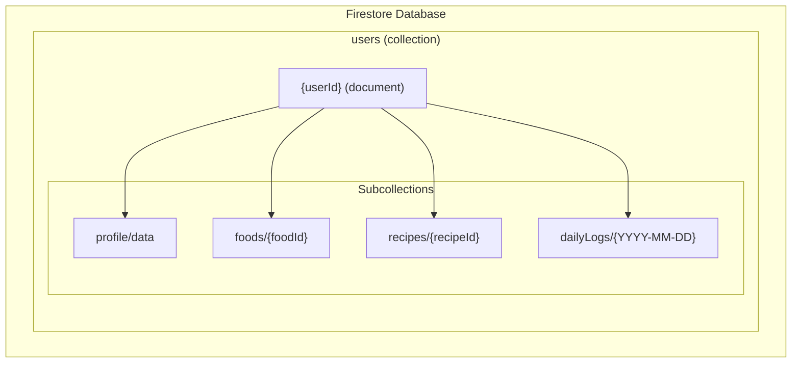
```mermaid
flowchart TB
    subgraph Firestore["Firestore Database"]
        subgraph Users["users (collection)"]
            UserDoc["{userId} (document)"]
            
            subgraph UserSubcollections["Subcollections"]
                Profile["profile/data"]
                Foods["foods/{foodId}"]
                Recipes["recipes/{recipeId}"]
                DailyLogs["dailyLogs/{YYYY-MM-DD}"]
            end
        end
    end
    
    UserDoc --> Profile
    UserDoc --> Foods
    UserDoc --> Recipes
    UserDoc --> DailyLogs
```

### Collection Paths

| Collection | Path | Document ID | Description |
|------------|------|-------------|-------------|
| User Profile | `users/{userId}/profile/data` | `data` (singleton) | User settings and macro targets |
| Foods | `users/{userId}/foods/{foodId}` | Auto-generated UUID | Custom food items |
| Recipes | `users/{userId}/recipes/{recipeId}` | Auto-generated UUID | User-created recipes |
| Daily Logs | `users/{userId}/dailyLogs/{date}` | `YYYY-MM-DD` | Daily meal tracking |

### Document Schemas

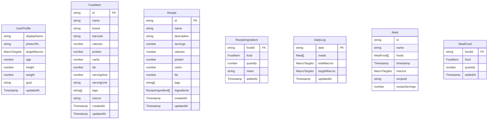
```mermaid
erDiagram
    UserProfile {
        string displayName
        string photoURL
        MacroTargets targetMacros
        number age
        number height
        number weight
        string goal
        Timestamp updatedAt
    }
    
    FoodItem {
        string id PK
        string name
        string brand
        string barcode
        number calories
        number protein
        number carbs
        number fat
        number servingSize
        string servingUnit
        string[] tags
        string source
        Timestamp createdAt
        Timestamp updatedAt
    }
    
    Recipe {
        string id PK
        string name
        string description
        number servings
        number calories
        number protein
        number carbs
        number fat
        string[] tags
        RecipeIngredient[] ingredients
        Timestamp createdAt
        Timestamp updatedAt
    }
    
    RecipeIngredient {
        string foodId FK
        FoodItem food
        number quantity
        string notes
        Timestamp addedAt
    }
    
    DailyLog {
        string date PK
        Meal[] meals
        MacroTargets totalMacros
        MacroTargets targetMacros
        Timestamp updatedAt
    }
    
    Meal {
        string id
        string name
        MealFood[] foods
        Timestamp timestamp
        MacroTargets macros
        string recipeId
        number recipeServings
    }
    
    MealFood {
        string foodId FK
        FoodItem food
        number quantity
        Timestamp addedAt
    }
```

## Firestore Optimization Strategies

### 1. Denormalization for Read Performance

Firestore charges per document read, so we denormalize data to minimize reads:

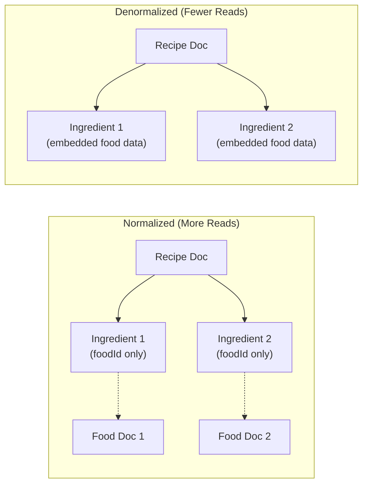
```mermaid
flowchart LR
    subgraph Normalized["Normalized (More Reads)"]
        Recipe1["Recipe Doc"]
        Ingredient1["Ingredient 1<br/>(foodId only)"]
        Ingredient2["Ingredient 2<br/>(foodId only)"]
        Food1["Food Doc 1"]
        Food2["Food Doc 2"]
        
        Recipe1 --> Ingredient1
        Recipe1 --> Ingredient2
        Ingredient1 -.-> Food1
        Ingredient2 -.-> Food2
    end
    
    subgraph Denormalized["Denormalized (Fewer Reads)"]
        Recipe2["Recipe Doc"]
        IngredientEmbed1["Ingredient 1<br/>(embedded food data)"]
        IngredientEmbed2["Ingredient 2<br/>(embedded food data)"]
        
        Recipe2 --> IngredientEmbed1
        Recipe2 --> IngredientEmbed2
    end
```

**Recipe Ingredient Storage Strategy:**
- Embed the full `FoodItem` snapshot in each ingredient (mirrors `MealFood` pattern)
- Store `foodId` reference for updates/linking back to original
- Avoids N+1 reads when loading recipes
- Consistent structure between `RecipeIngredient` and `MealFood`

### 2. Embedded vs. Subcollection Decision

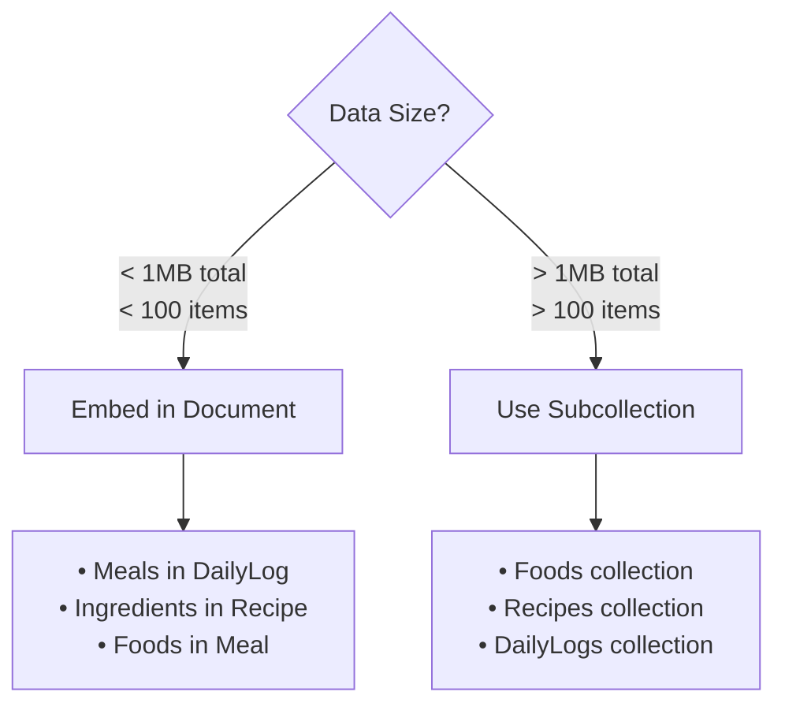
```mermaid
flowchart TD
    Question{"Data Size?"}
    
    Question -->|"< 1MB total<br/>< 100 items"| Embed["Embed in Document"]
    Question -->|"> 1MB total<br/>> 100 items"| Subcollection["Use Subcollection"]
    
    Embed --> Examples1["• Meals in DailyLog<br/>• Ingredients in Recipe<br/>• Foods in Meal"]
    Subcollection --> Examples2["• Foods collection<br/>• Recipes collection<br/>• DailyLogs collection"]
```

**Current Design Decisions:**
| Data | Storage | Reason |
|------|---------|--------|
| Meals | Embedded in DailyLog | Typically < 10 meals/day |
| Foods in Meal | Embedded in Meal | Typically < 20 foods/meal |
| Recipe Ingredients | Embedded in Recipe | Typically < 30 ingredients |
| User Foods | Subcollection | Can grow unbounded |
| User Recipes | Subcollection | Can grow unbounded |

### 3. Index Strategy

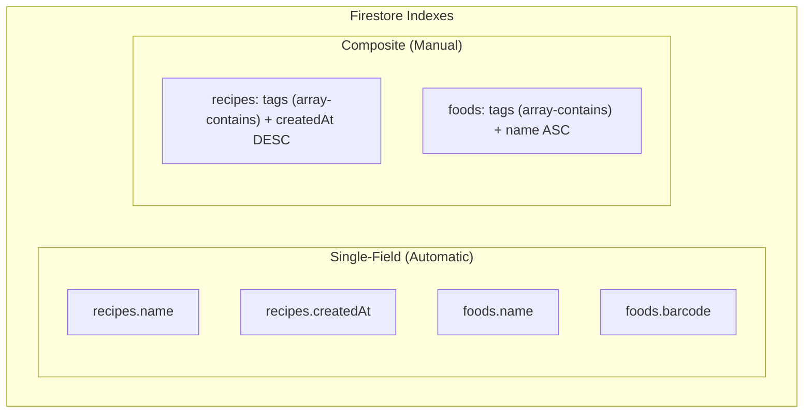
```mermaid
flowchart TB
    subgraph Indexes["Firestore Indexes"]
        subgraph Single["Single-Field (Automatic)"]
            I1["recipes.name"]
            I2["recipes.createdAt"]
            I3["foods.name"]
            I4["foods.barcode"]
        end
        
        subgraph Composite["Composite (Manual)"]
            C1["recipes: tags (array-contains) + createdAt DESC"]
            C2["foods: tags (array-contains) + name ASC"]
        end
    end
```

## Repository Pattern Architecture

The repository pattern provides a clean abstraction over Firestore operations with local caching support.

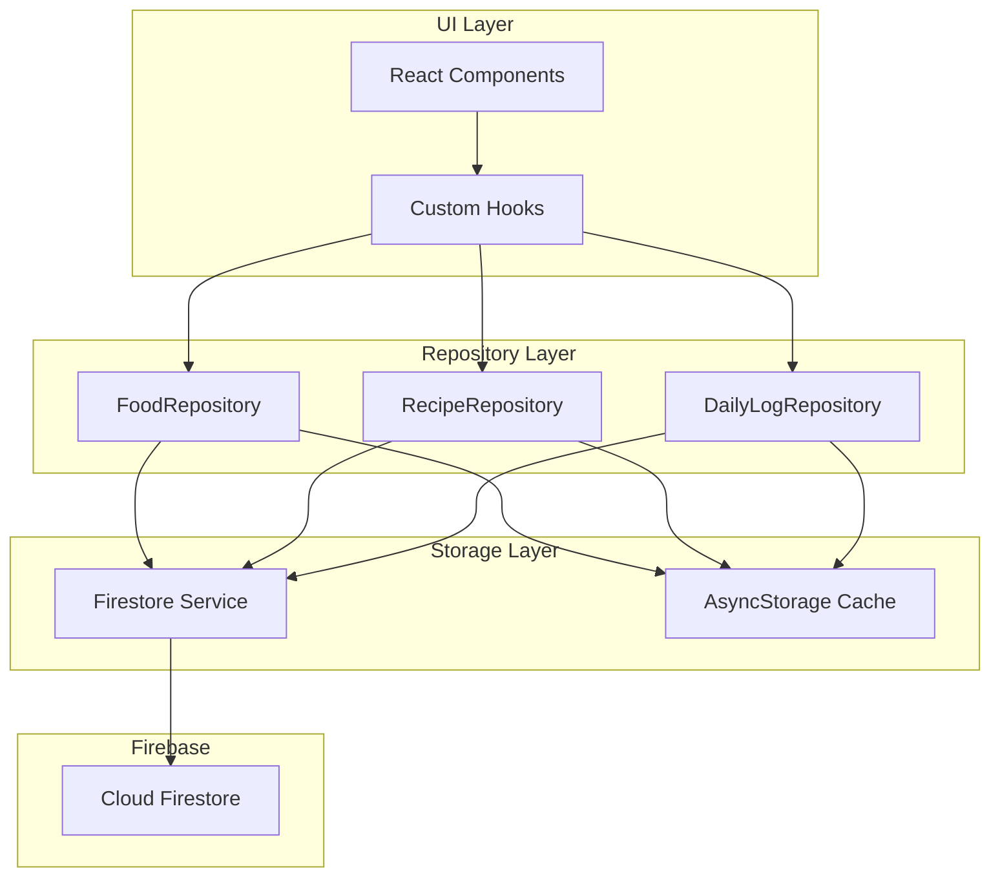
```mermaid
flowchart TB
    subgraph UI["UI Layer"]
        Components["React Components"]
        Hooks["Custom Hooks"]
    end
    
    subgraph Repository["Repository Layer"]
        FoodRepo["FoodRepository"]
        RecipeRepo["RecipeRepository"]
        DailyLogRepo["DailyLogRepository"]
    end
    
    subgraph Storage["Storage Layer"]
        FirestoreService["Firestore Service"]
        LocalCache["AsyncStorage Cache"]
    end
    
    subgraph Firebase["Firebase"]
        Firestore["Cloud Firestore"]
    end
    
    Components --> Hooks
    Hooks --> FoodRepo
    Hooks --> RecipeRepo
    Hooks --> DailyLogRepo
    
    FoodRepo --> FirestoreService
    FoodRepo --> LocalCache
    RecipeRepo --> FirestoreService
    RecipeRepo --> LocalCache
    DailyLogRepo --> FirestoreService
    DailyLogRepo --> LocalCache
    
    FirestoreService --> Firestore
```

### Repository Interface Design

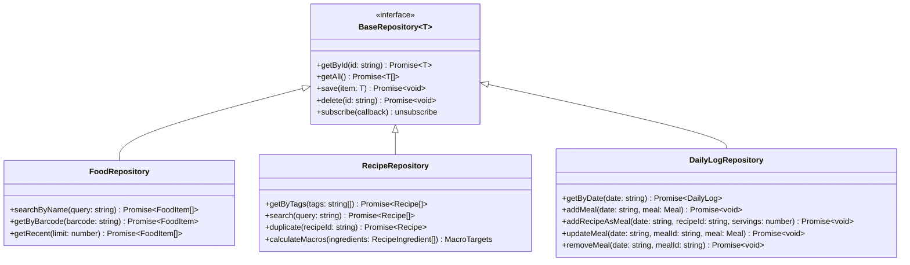
```mermaid
classDiagram
    class BaseRepository~T~ {
        <<interface>>
        +getById(id: string) Promise~T~
        +getAll() Promise~T[]~
        +save(item: T) Promise~void~
        +delete(id: string) Promise~void~
        +subscribe(callback) unsubscribe
    }
    
    class FoodRepository {
        +searchByName(query: string) Promise~FoodItem[]~
        +getByBarcode(barcode: string) Promise~FoodItem~
        +getRecent(limit: number) Promise~FoodItem[]~
    }
    
    class RecipeRepository {
        +getByTags(tags: string[]) Promise~Recipe[]~
        +search(query: string) Promise~Recipe[]~
        +duplicate(recipeId: string) Promise~Recipe~
        +calculateMacros(ingredients: RecipeIngredient[]) MacroTargets
    }
    
    class DailyLogRepository {
        +getByDate(date: string) Promise~DailyLog~
        +addMeal(date: string, meal: Meal) Promise~void~
        +addRecipeAsMeal(date: string, recipeId: string, servings: number) Promise~void~
        +updateMeal(date: string, mealId: string, meal: Meal) Promise~void~
        +removeMeal(date: string, mealId: string) Promise~void~
    }
    
    BaseRepository <|-- FoodRepository
    BaseRepository <|-- RecipeRepository
    BaseRepository <|-- DailyLogRepository
```

### Cache-First Strategy

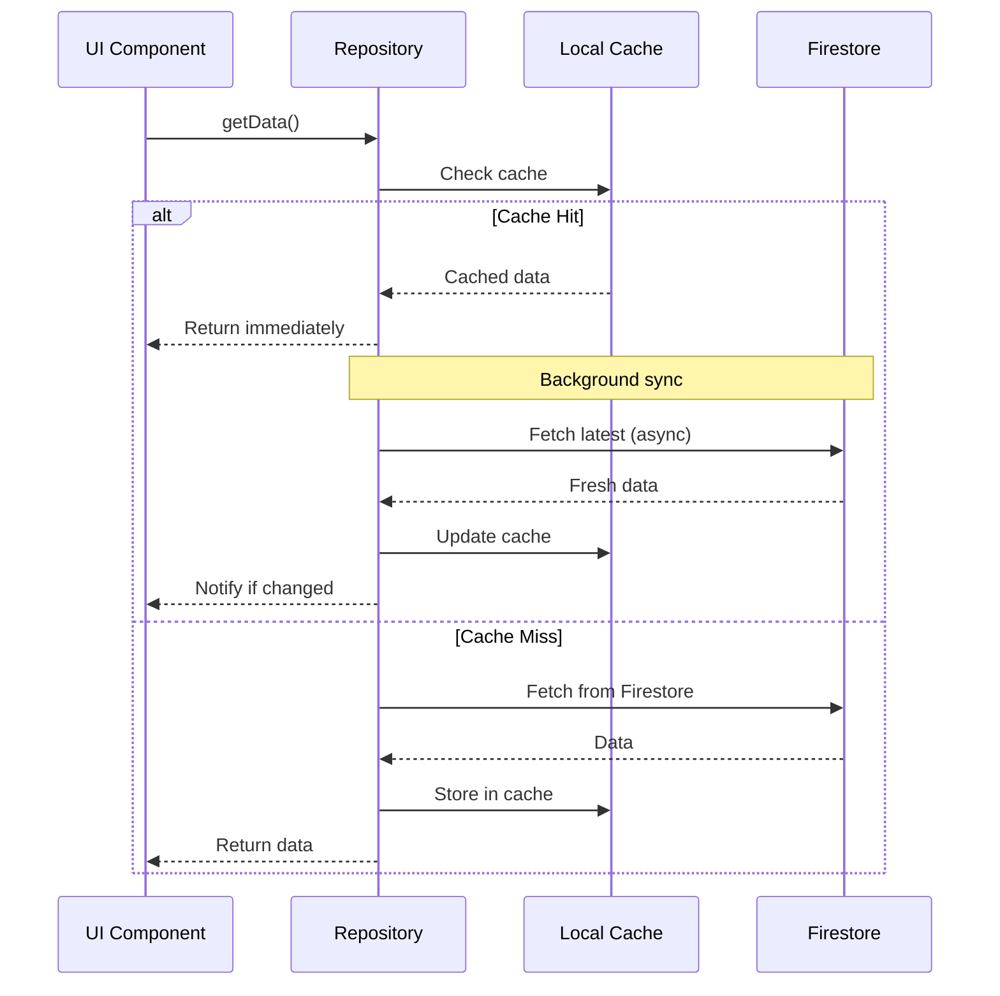
```mermaid
sequenceDiagram
    participant UI as UI Component
    participant Repo as Repository
    participant Cache as Local Cache
    participant FS as Firestore
    
    UI->>Repo: getData()
    
    Repo->>Cache: Check cache
    
    alt Cache Hit
        Cache-->>Repo: Cached data
        Repo-->>UI: Return immediately
        
        Note over Repo,FS: Background sync
        Repo->>FS: Fetch latest (async)
        FS-->>Repo: Fresh data
        Repo->>Cache: Update cache
        Repo-->>UI: Notify if changed
    else Cache Miss
        Repo->>FS: Fetch from Firestore
        FS-->>Repo: Data
        Repo->>Cache: Store in cache
        Repo-->>UI: Return data
    end
```

### Write-Through Cache Pattern

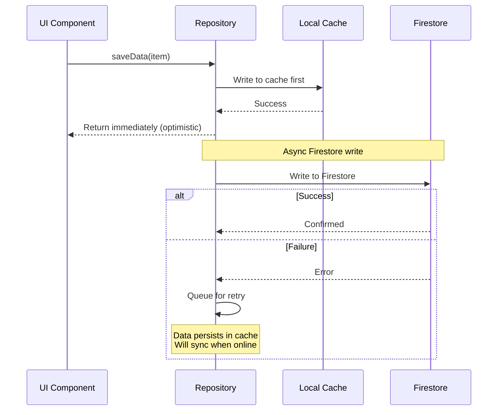
```mermaid
sequenceDiagram
    participant UI as UI Component
    participant Repo as Repository
    participant Cache as Local Cache
    participant FS as Firestore
    
    UI->>Repo: saveData(item)
    
    Repo->>Cache: Write to cache first
    Cache-->>Repo: Success
    Repo-->>UI: Return immediately (optimistic)
    
    Note over Repo,FS: Async Firestore write
    Repo->>FS: Write to Firestore
    
    alt Success
        FS-->>Repo: Confirmed
    else Failure
        FS-->>Repo: Error
        Repo->>Repo: Queue for retry
        Note over Repo: Data persists in cache<br/>Will sync when online
    end
```

## Food Creation Flow

### Food Sources Integration

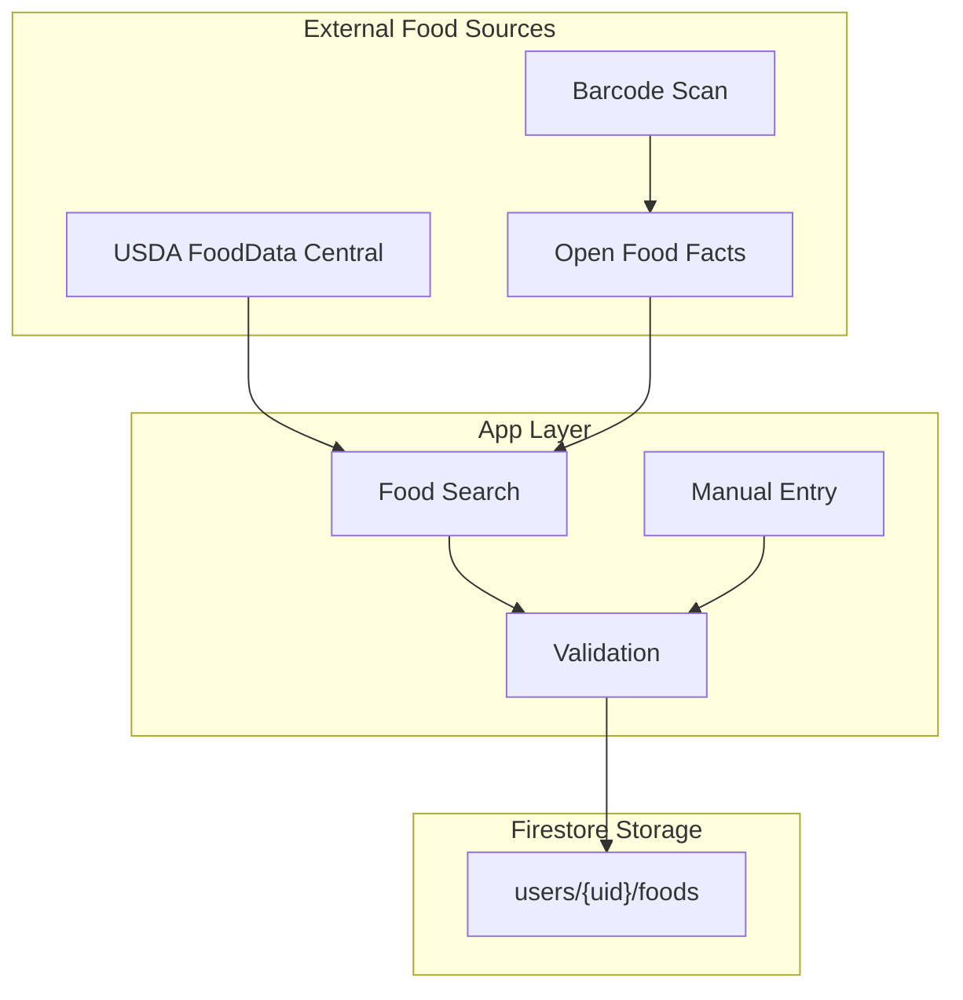
```mermaid
flowchart TB
    subgraph Sources["External Food Sources"]
        USDA["USDA FoodData Central"]
        OFF["Open Food Facts"]
        Barcode["Barcode Scan"]
    end
    
    subgraph App["App Layer"]
        Search["Food Search"]
        Manual["Manual Entry"]
        Validate["Validation"]
    end
    
    subgraph Storage["Firestore Storage"]
        UserFoods["users/{uid}/foods"]
    end
    
    USDA --> Search
    OFF --> Search
    Barcode --> OFF
    
    Search --> Validate
    Manual --> Validate
    
    Validate --> UserFoods
```

### Food Creation Sequence

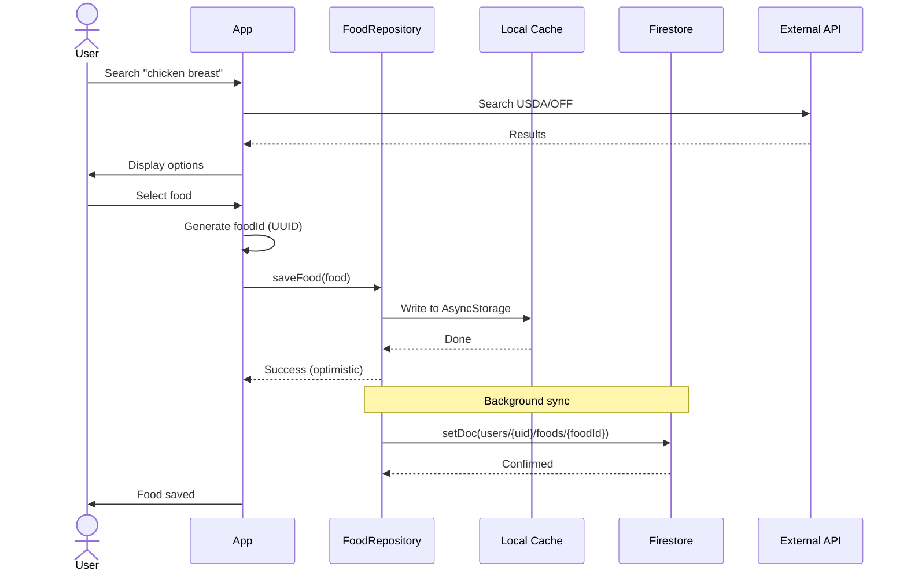
```mermaid
sequenceDiagram
    actor User
    participant App as App
    participant FoodRepo as FoodRepository
    participant Cache as Local Cache
    participant FS as Firestore
    participant API as External API
    
    User->>App: Search "chicken breast"
    
    App->>API: Search USDA/OFF
    API-->>App: Results
    App->>User: Display options
    
    User->>App: Select food
    App->>App: Generate foodId (UUID)
    
    App->>FoodRepo: saveFood(food)
    FoodRepo->>Cache: Write to AsyncStorage
    Cache-->>FoodRepo: Done
    FoodRepo-->>App: Success (optimistic)
    
    Note over FoodRepo,FS: Background sync
    FoodRepo->>FS: setDoc(users/{uid}/foods/{foodId})
    FS-->>FoodRepo: Confirmed
    
    App->>User: Food saved
```

### Food Validation Logic

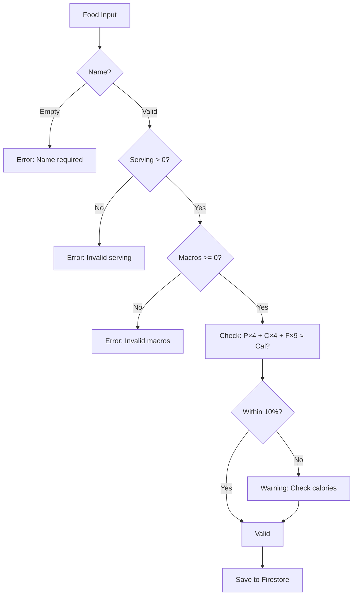
```mermaid
flowchart TD
    Start["Food Input"] --> ValidateName{"Name?"}
    ValidateName -->|Empty| ErrName["Error: Name required"]
    ValidateName -->|Valid| ValidateServing{"Serving > 0?"}
    
    ValidateServing -->|No| ErrServing["Error: Invalid serving"]
    ValidateServing -->|Yes| ValidateMacros{"Macros >= 0?"}
    
    ValidateMacros -->|No| ErrMacros["Error: Invalid macros"]
    ValidateMacros -->|Yes| CalcCheck["Check: P×4 + C×4 + F×9 ≈ Cal?"]
    
    CalcCheck --> CalcMatch{"Within 10%?"}
    CalcMatch -->|No| WarnCal["Warning: Check calories"]
    CalcMatch -->|Yes| Valid["Valid"]
    WarnCal --> Valid
    
    Valid --> Save["Save to Firestore"]
```

## Recipe Creation Flow

### Recipe Building Process

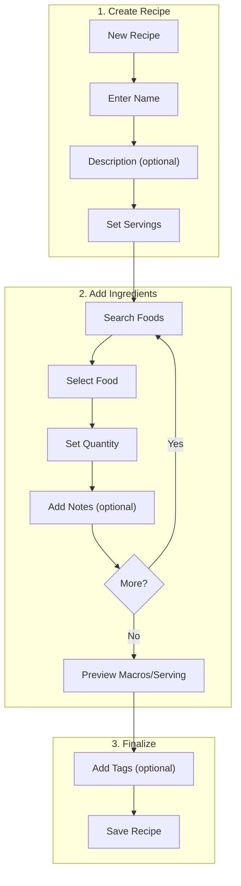
```mermaid
flowchart TB
    subgraph Phase1["1. Create Recipe"]
        Start["New Recipe"] --> Name["Enter Name"]
        Name --> Desc["Description (optional)"]
        Desc --> Servings["Set Servings"]
    end
    
    subgraph Phase2["2. Add Ingredients"]
        Servings --> SearchFood["Search Foods"]
        SearchFood --> SelectFood["Select Food"]
        SelectFood --> SetQty["Set Quantity"]
        SetQty --> Notes["Add Notes (optional)"]
        Notes --> More{"More?"}
        More -->|Yes| SearchFood
        More -->|No| Preview
    end
    
    subgraph Phase3["3. Finalize"]
        Preview["Preview Macros/Serving"]
        Preview --> Tags["Add Tags (optional)"]
        Tags --> Save["Save Recipe"]
    end
```

### Recipe Macro Calculation

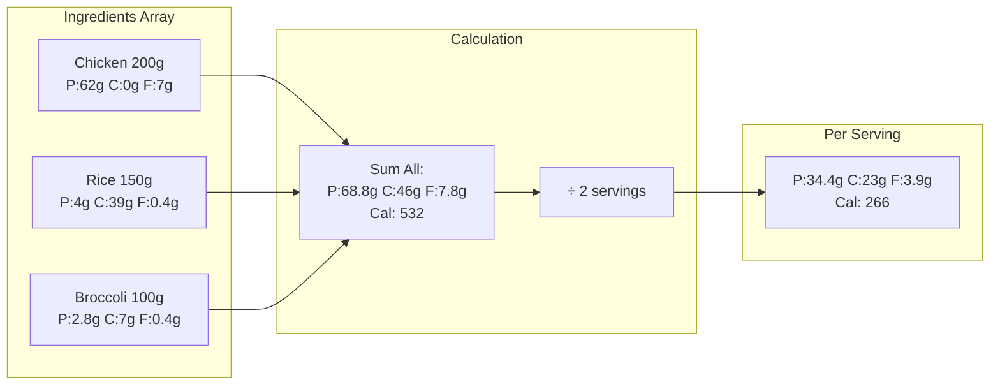
```mermaid
flowchart LR
    subgraph Ingredients["Ingredients Array"]
        I1["Chicken 200g<br/>P:62g C:0g F:7g"]
        I2["Rice 150g<br/>P:4g C:39g F:0.4g"]
        I3["Broccoli 100g<br/>P:2.8g C:7g F:0.4g"]
    end
    
    subgraph Calc["Calculation"]
        Sum["Sum All:<br/>P:68.8g C:46g F:7.8g<br/>Cal: 532"]
        Div["÷ 2 servings"]
    end
    
    subgraph Result["Per Serving"]
        Final["P:34.4g C:23g F:3.9g<br/>Cal: 266"]
    end
    
    I1 --> Sum
    I2 --> Sum
    I3 --> Sum
    Sum --> Div
    Div --> Final
```

### Recipe Save Sequence

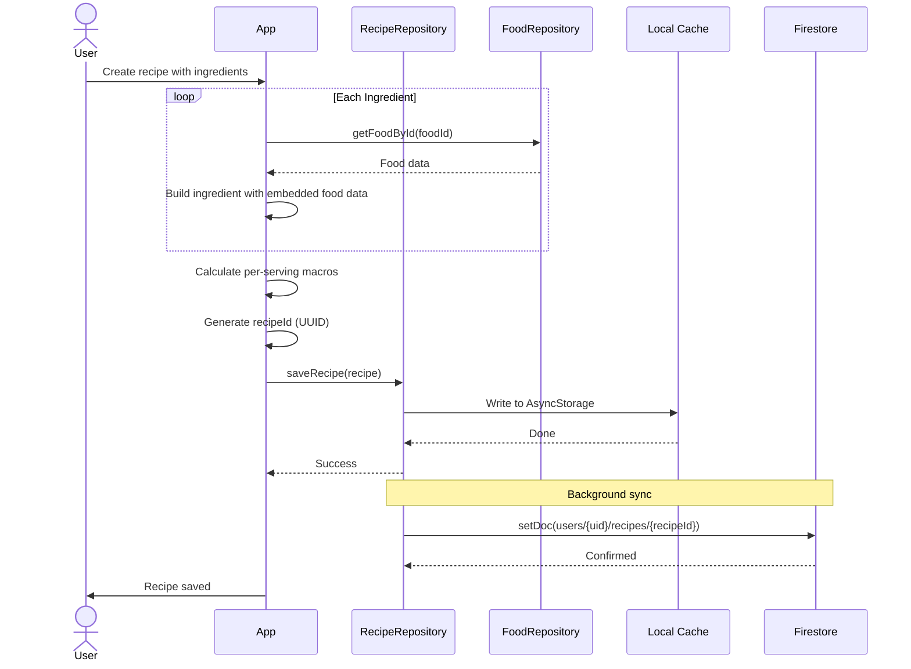
```mermaid
sequenceDiagram
    actor User
    participant App as App
    participant RecipeRepo as RecipeRepository
    participant FoodRepo as FoodRepository
    participant Cache as Local Cache
    participant FS as Firestore
    
    User->>App: Create recipe with ingredients
    
    loop Each Ingredient
        App->>FoodRepo: getFoodById(foodId)
        FoodRepo-->>App: Food data
        App->>App: Build ingredient with embedded food data
    end
    
    App->>App: Calculate per-serving macros
    App->>App: Generate recipeId (UUID)
    
    App->>RecipeRepo: saveRecipe(recipe)
    RecipeRepo->>Cache: Write to AsyncStorage
    Cache-->>RecipeRepo: Done
    RecipeRepo-->>App: Success
    
    Note over RecipeRepo,FS: Background sync
    RecipeRepo->>FS: setDoc(users/{uid}/recipes/{recipeId})
    FS-->>RecipeRepo: Confirmed
    
    App->>User: Recipe saved
```

### Recipe Document Structure

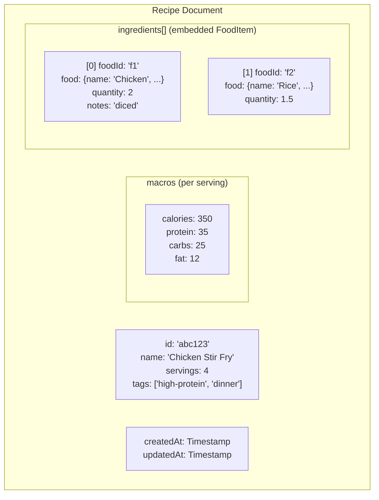
```mermaid
flowchart TB
    subgraph RecipeDoc["Recipe Document"]
        Meta["id: 'abc123'<br/>name: 'Chicken Stir Fry'<br/>servings: 4<br/>tags: ['high-protein', 'dinner']"]
        
        subgraph Macros["macros (per serving)"]
            M["calories: 350<br/>protein: 35<br/>carbs: 25<br/>fat: 12"]
        end
        
        subgraph Ingredients["ingredients[] (embedded FoodItem)"]
            Ing1["[0] foodId: 'f1'<br/>food: {name: 'Chicken', ...}<br/>quantity: 2<br/>notes: 'diced'"]
            Ing2["[1] foodId: 'f2'<br/>food: {name: 'Rice', ...}<br/>quantity: 1.5"]
        end
        
        Times["createdAt: Timestamp<br/>updatedAt: Timestamp"]
    end
```

## Using Recipes for Tracking

### Adding Recipe to Daily Log

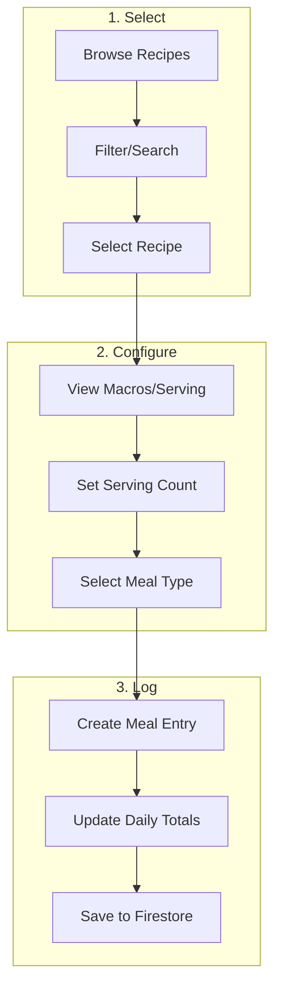
```mermaid
flowchart TB
    subgraph Select["1. Select"]
        Browse["Browse Recipes"]
        Browse --> Filter["Filter/Search"]
        Filter --> Choose["Select Recipe"]
    end
    
    subgraph Configure["2. Configure"]
        Choose --> ViewMacros["View Macros/Serving"]
        ViewMacros --> SetServings["Set Serving Count"]
        SetServings --> SelectMeal["Select Meal Type"]
    end
    
    subgraph Log["3. Log"]
        SelectMeal --> CreateMeal["Create Meal Entry"]
        CreateMeal --> UpdateTotals["Update Daily Totals"]
        UpdateTotals --> SaveLog["Save to Firestore"]
    end
```

### Recipe to Meal Conversion

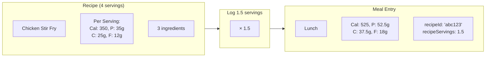
```mermaid
flowchart LR
    subgraph Recipe["Recipe (4 servings)"]
        R_Meta["Chicken Stir Fry"]
        R_Macros["Per Serving:<br/>Cal: 350, P: 35g<br/>C: 25g, F: 12g"]
        R_Ingredients["3 ingredients"]
    end
    
    subgraph Conversion["Log 1.5 servings"]
        Multiply["× 1.5"]
    end
    
    subgraph Meal["Meal Entry"]
        M_Name["Lunch"]
        M_Macros["Cal: 525, P: 52.5g<br/>C: 37.5g, F: 18g"]
        M_Ref["recipeId: 'abc123'<br/>recipeServings: 1.5"]
    end
    
    Recipe --> Conversion
    Conversion --> Meal
```

### Tracking Flow Sequence

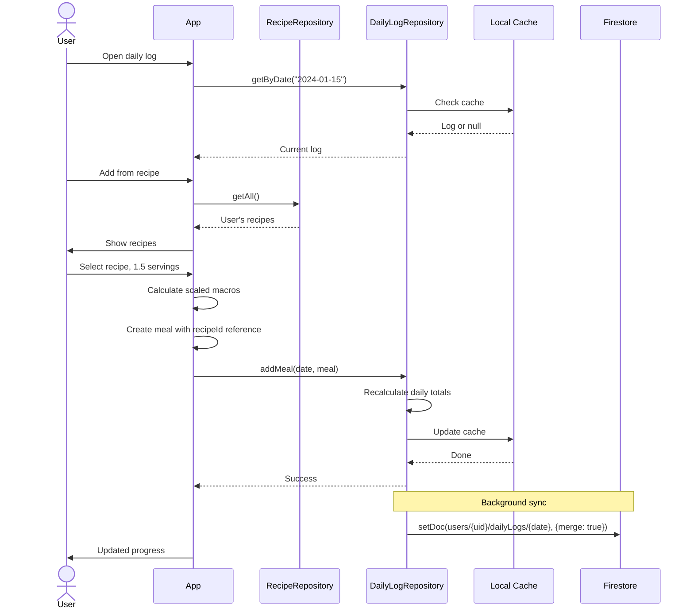
```mermaid
sequenceDiagram
    actor User
    participant App as App
    participant RecipeRepo as RecipeRepository
    participant LogRepo as DailyLogRepository
    participant Cache as Local Cache
    participant FS as Firestore
    
    User->>App: Open daily log
    App->>LogRepo: getByDate("2024-01-15")
    LogRepo->>Cache: Check cache
    Cache-->>LogRepo: Log or null
    LogRepo-->>App: Current log
    
    User->>App: Add from recipe
    App->>RecipeRepo: getAll()
    RecipeRepo-->>App: User's recipes
    App->>User: Show recipes
    
    User->>App: Select recipe, 1.5 servings
    
    App->>App: Calculate scaled macros
    App->>App: Create meal with recipeId reference
    
    App->>LogRepo: addMeal(date, meal)
    LogRepo->>LogRepo: Recalculate daily totals
    LogRepo->>Cache: Update cache
    Cache-->>LogRepo: Done
    LogRepo-->>App: Success
    
    Note over LogRepo,FS: Background sync
    LogRepo->>FS: setDoc(users/{uid}/dailyLogs/{date}, {merge: true})
    
    App->>User: Updated progress
```

### Daily Log Document with Recipe Reference

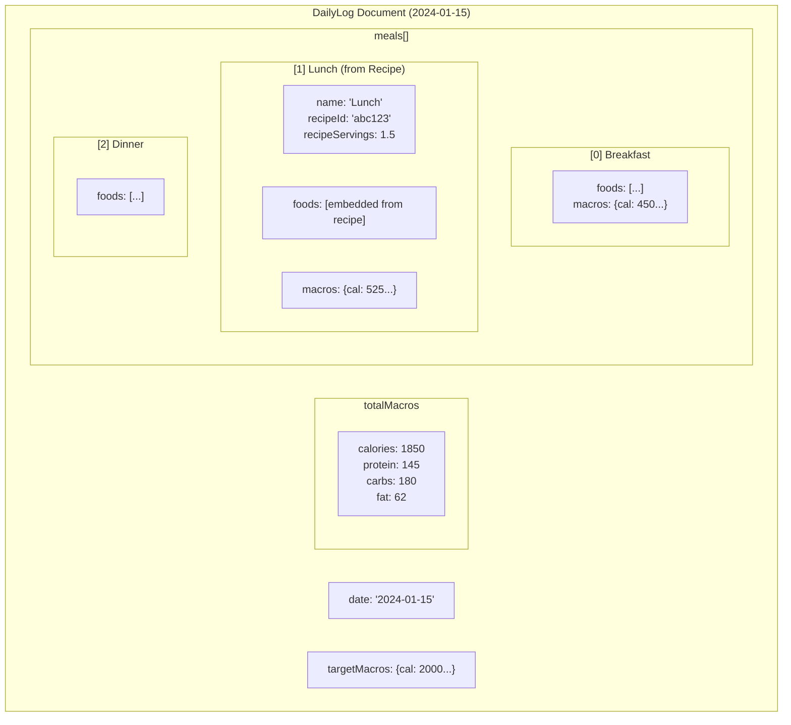
```mermaid
flowchart TB
    subgraph DailyLogDoc["DailyLog Document (2024-01-15)"]
        LogMeta["date: '2024-01-15'"]
        
        subgraph TotalMacros["totalMacros"]
            TM["calories: 1850<br/>protein: 145<br/>carbs: 180<br/>fat: 62"]
        end
        
        subgraph Meals["meals[]"]
            subgraph Meal1["[0] Breakfast"]
                M1_Foods["foods: [...]<br/>macros: {cal: 450...}"]
            end
            
            subgraph Meal2["[1] Lunch (from Recipe)"]
                M2_Meta["name: 'Lunch'<br/>recipeId: 'abc123'<br/>recipeServings: 1.5"]
                M2_Foods["foods: [embedded from recipe]"]
                M2_Macros["macros: {cal: 525...}"]
            end
            
            subgraph Meal3["[2] Dinner"]
                M3_Foods["foods: [...]"]
            end
        end
        
        TargetMacros["targetMacros: {cal: 2000...}"]
    end
```

## Recipe Scaling

### Scaling for Different Serving Counts

```mermaid
flowchart TB
    subgraph Original["Original Recipe (4 servings)"]
        O_Ing["Chicken: 400g<br/>Rice: 300g<br/>Vegetables: 200g"]
        O_Macros["Total: 1400 cal<br/>Per serving: 350 cal"]
    end
    
    subgraph Scale["Scale to 6 servings"]
        Factor["Factor = 6/4 = 1.5"]
    end
    
    subgraph Scaled["Scaled Recipe"]
        S_Ing["Chicken: 600g<br/>Rice: 450g<br/>Vegetables: 300g"]
        S_Macros["Total: 2100 cal<br/>Per serving: 350 cal<br/>(unchanged)"]
    end
    
    Original --> Scale
    Scale --> Scaled
```

### Meal Prep Workflow

```mermaid
sequenceDiagram
    actor User
    participant App as App
    participant RecipeRepo as RecipeRepository
    
    User->>App: Open recipe for meal prep
    App->>RecipeRepo: getById(recipeId)
    RecipeRepo-->>App: Recipe (4 servings)
    
    User->>App: Scale to 12 servings (3x)
    App->>App: Scale all ingredient quantities × 3
    App->>User: Show scaled ingredients
    
    User->>App: Generate shopping list
    App->>App: Aggregate ingredients by food
    App->>App: Round to practical quantities
    App->>User: Shopping list
    
    Note over User,App: User can log individual<br/>servings throughout the week
```

## Real-Time Sync with Firestore

### Subscription Pattern

```mermaid
sequenceDiagram
    participant App as App
    participant Repo as Repository
    participant FS as Firestore
    
    App->>Repo: subscribe(callback)
    Repo->>FS: onSnapshot(collection)
    
    FS-->>Repo: Initial data
    Repo-->>App: callback(data)
    
    Note over FS: Another device<br/>makes changes
    
    FS-->>Repo: Updated data
    Repo->>Repo: Update local cache
    Repo-->>App: callback(newData)
    
    App->>Repo: unsubscribe()
    Repo->>FS: Detach listener
```

### Multi-Device Sync

```mermaid
flowchart TB
    subgraph Device1["Mobile Device"]
        App1["App"]
        Cache1["Local Cache"]
    end
    
    subgraph Cloud["Firebase"]
        FS["Firestore"]
    end
    
    subgraph Device2["Web Browser"]
        App2["Web App"]
        Cache2["Local Storage"]
    end
    
    App1 <-->|"onSnapshot"| FS
    App2 <-->|"onSnapshot"| FS
    
    App1 --> Cache1
    App2 --> Cache2
```

## Repository Implementation Examples

### Base Repository Pattern

```typescript
// Base repository interface
interface Repository<T> {
  getById(id: string): Promise<T | null>;
  getAll(): Promise<T[]>;
  save(item: T): Promise<void>;
  delete(id: string): Promise<void>;
  subscribe(callback: (items: T[]) => void): () => void;
}

// Firestore path helper
function getUserPath(userId: string, collection: string): string {
  return `users/${userId}/${collection}`;
}
```

### Recipe Repository Example

```typescript
// Recipe repository implementation
class RecipeRepository implements Repository<Recipe> {
  private userId: string;
  private cache: Map<string, Recipe> = new Map();
  
  async getById(recipeId: string): Promise<Recipe | null> {
    // Check cache first
    if (this.cache.has(recipeId)) {
      return this.cache.get(recipeId)!;
    }
    
    // Fetch from Firestore
    const docRef = doc(db, getUserPath(this.userId, 'recipes'), recipeId);
    const snapshot = await getDoc(docRef);
    
    if (snapshot.exists()) {
      const recipe = { id: snapshot.id, ...snapshot.data() } as Recipe;
      this.cache.set(recipeId, recipe);
      return recipe;
    }
    return null;
  }
  
  async save(recipe: Recipe): Promise<void> {
    // Update cache immediately (optimistic)
    this.cache.set(recipe.id, recipe);
    
    // Calculate per-serving macros
    const totalMacros = this.calculateTotalMacros(recipe.ingredients);
    recipe.macros = {
      calories: totalMacros.calories / recipe.servings,
      protein: totalMacros.protein / recipe.servings,
      carbs: totalMacros.carbs / recipe.servings,
      fat: totalMacros.fat / recipe.servings,
    };
    
    // Write to Firestore
    const docRef = doc(db, getUserPath(this.userId, 'recipes'), recipe.id);
    await setDoc(docRef, {
      ...recipe,
      updatedAt: Timestamp.now(),
    });
  }
  
  async addRecipeToMeal(
    date: string, 
    recipeId: string, 
    servings: number,
    mealName: string
  ): Promise<void> {
    const recipe = await this.getById(recipeId);
    if (!recipe) throw new Error('Recipe not found');
    
    // Scale macros by serving count
    const scaledMacros = {
      calories: recipe.macros.calories * servings,
      protein: recipe.macros.protein * servings,
      carbs: recipe.macros.carbs * servings,
      fat: recipe.macros.fat * servings,
    };
    
    // Convert RecipeIngredients to MealFoods (same structure)
    const foods: MealFood[] = recipe.ingredients.map(ing => ({
      foodId: ing.foodId,
      food: ing.food,  // Already embedded FoodItem
      quantity: ing.quantity * servings,
      addedAt: new Date(),
    }));
    
    // Create meal with recipe reference
    const meal: Meal = {
      id: generateId(),
      name: mealName,
      foods,
      timestamp: new Date(),
      macros: scaledMacros,
      recipeId,
      recipeServings: servings,
    };
    
    // Add to daily log via DailyLogRepository
    await dailyLogRepo.addMeal(date, meal);
  }
}
```

## Error Handling

### Offline Error Recovery

```mermaid
flowchart TD
    Action["User Action"] --> TryCache["Write to Cache"]
    TryCache --> CacheOK{"Cache OK?"}
    
    CacheOK -->|Yes| TryFirestore["Write to Firestore"]
    CacheOK -->|No| ShowError["Show Error"]
    
    TryFirestore --> FSOK{"Firestore OK?"}
    
    FSOK -->|Yes| Done["Success"]
    FSOK -->|No| Queue["Queue for Retry"]
    
    Queue --> ShowOffline["Show Offline Indicator"]
    ShowOffline --> WaitOnline["Wait for Connection"]
    WaitOnline --> Retry["Retry Sync"]
    Retry --> FSOK
```

### Error States

```mermaid
stateDiagram-v2
    [*] --> Idle
    
    Idle --> Saving: User action
    Saving --> Saved: Success
    Saving --> CachedPending: Firestore offline
    Saving --> Error: Cache failed
    
    CachedPending --> Syncing: Connection restored
    Syncing --> Saved: Sync success
    Syncing --> CachedPending: Sync failed
    
    Saved --> Idle: Done
    Error --> Idle: Dismissed
```

## Data Calculations

### Macro Calculation Formulas

**Ingredient Macros (scaled by quantity):**
```
ingredientMacros = food.macros × quantity
```

**Recipe Total Macros:**
```
totalMacros = Σ(ingredient.macros × ingredient.quantity)
```

**Recipe Per-Serving Macros:**
```
perServingMacros = totalMacros / recipe.servings
```

**Meal Macros (from recipe):**
```
mealMacros = recipe.perServingMacros × servingCount
```

**Daily Totals:**
```
dailyTotalMacros = Σ(meal.macros) for all meals
progress = (dailyTotalMacros / targetMacros) × 100
remaining = targetMacros - dailyTotalMacros
```

### Calorie Validation

```
expectedCalories = protein × 4 + carbs × 4 + fat × 9
isValid = |actualCalories - expectedCalories| / expectedCalories < 0.10
```

## Security Rules

Firestore security rules to protect user data:

```javascript
rules_version = '2';
service cloud.firestore {
  match /databases/{database}/documents {
    // Users can only access their own data
    match /users/{userId}/{document=**} {
      allow read, write: if request.auth != null && request.auth.uid == userId;
    }
  }
}
```

## Related Documentation

- [Data Models](./data-models.md) - Core entity definitions
- [User Stories: Meal Planning](./user-stories/meal-planning.md) - Recipe management user stories
- [User Stories: Core Tracking](./user-stories/core-tracking.md) - Meal logging user stories
- [Architecture](./architecture.md) - Technical architecture overview
