# Recipes Design

This document provides a comprehensive design for the recipes feature, including how to create foods, combine them into recipes, and use recipes for macro tracking.

## Overview

The recipes system enables users to:
1. **Create Foods** - Add individual food items with nutritional information
2. **Build Recipes** - Combine multiple foods into reusable recipes
3. **Track with Recipes** - Log recipes to daily meal tracking for macro monitoring

## Entity Relationships

The following diagram shows how the core entities relate to each other in the recipes and tracking system:

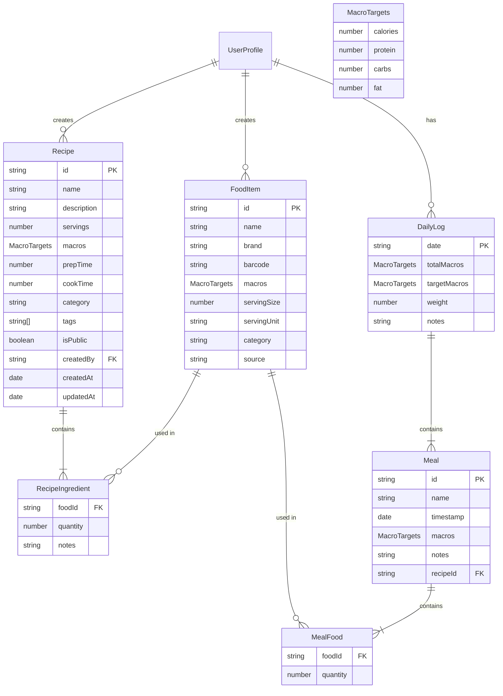

## Food Creation

### Food Sources

Foods can be added to the system from multiple sources:

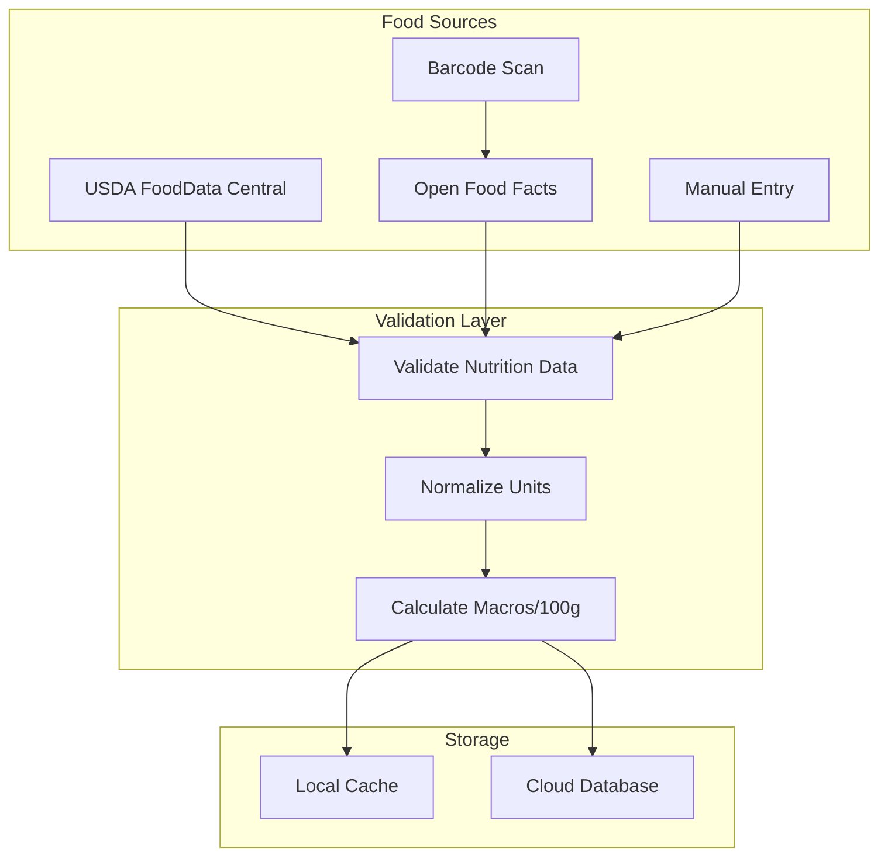

### Food Creation Flow

The following sequence diagram illustrates the food creation process:

```mermaid
sequenceDiagram
    actor User
    participant App as Mobile/Web App
    participant API as Backend API
    participant USDA as USDA API
    participant OFF as Open Food Facts
    participant DB as Database
    
    User->>App: Search for food or scan barcode
    
    alt Search by name
        App->>API: searchFood(query)
        API->>USDA: Search USDA database
        USDA-->>API: Return results
        API->>OFF: Search OFF database
        OFF-->>API: Return results
        API-->>App: Merged & deduplicated results
    else Scan barcode
        App->>API: lookupBarcode(code)
        API->>OFF: Lookup by barcode
        OFF-->>API: Return food data
        API-->>App: Food details
    end
    
    App->>User: Display food options
    User->>App: Select food or create custom
    
    alt Create custom food
        User->>App: Enter food details
        App->>App: Validate macro data
        App->>API: createFood(foodData)
        API->>DB: Save custom food
        DB-->>API: Food saved
        API-->>App: Food created
    else Select existing food
        App->>API: cacheFood(foodId)
        API->>DB: Save to user's food cache
    end
    
    App->>User: Food ready to use
```

### Food Data Validation

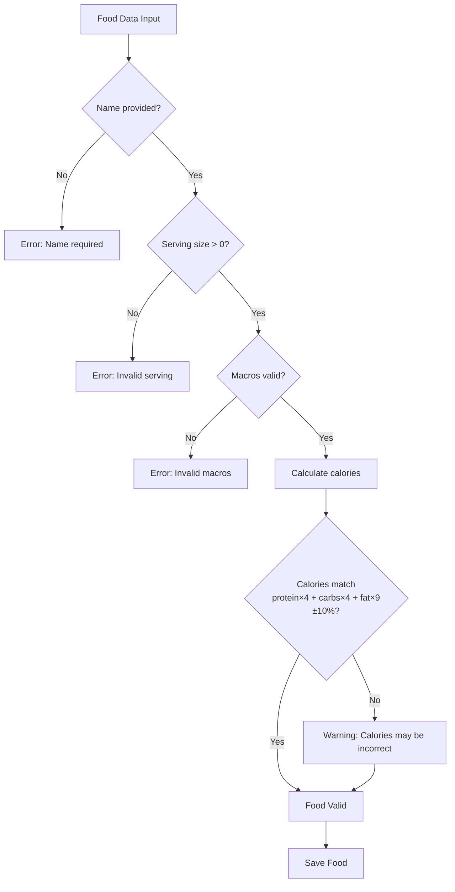

## Recipe Creation

### Recipe Building Flow

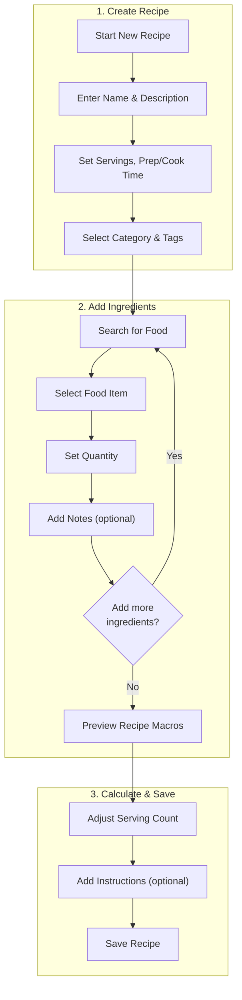

### Recipe Macro Calculation

The recipe macros are calculated as the sum of all ingredient macros, then divided by the number of servings:

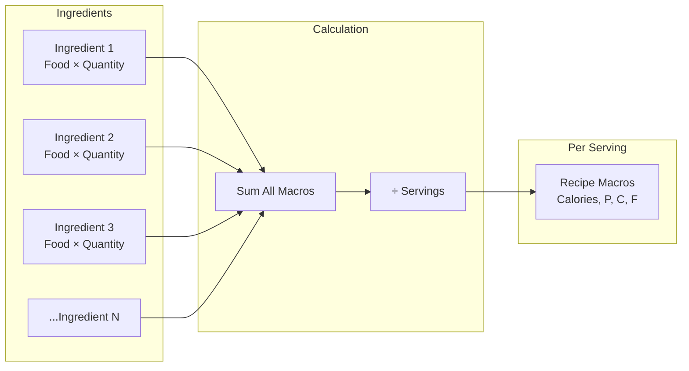

### Detailed Recipe Creation Sequence

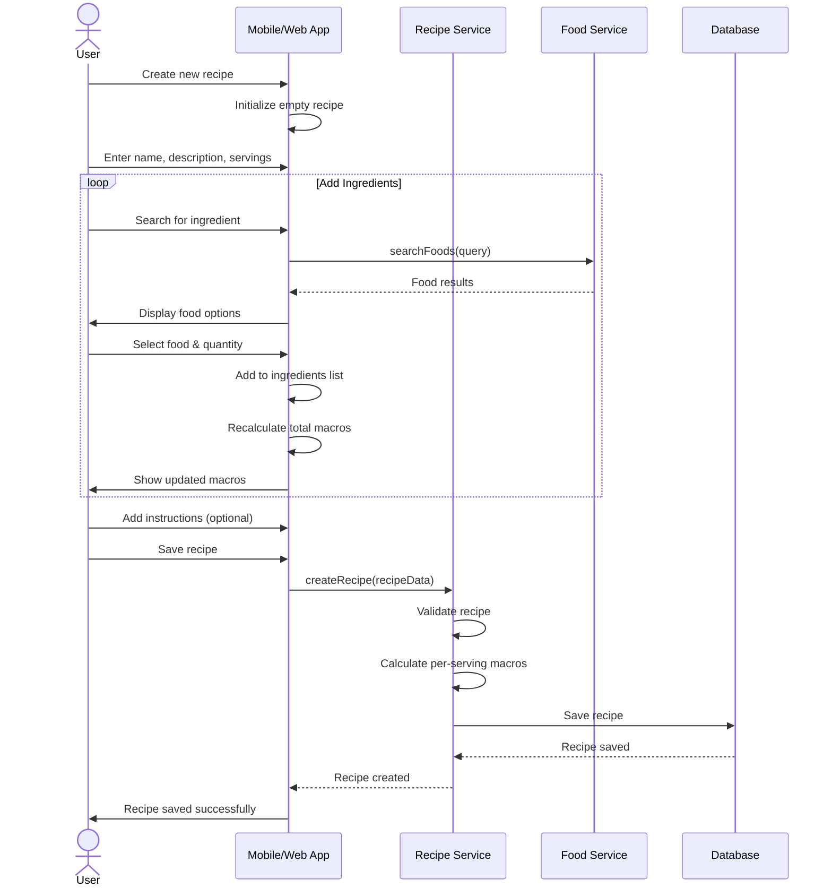

### Recipe States

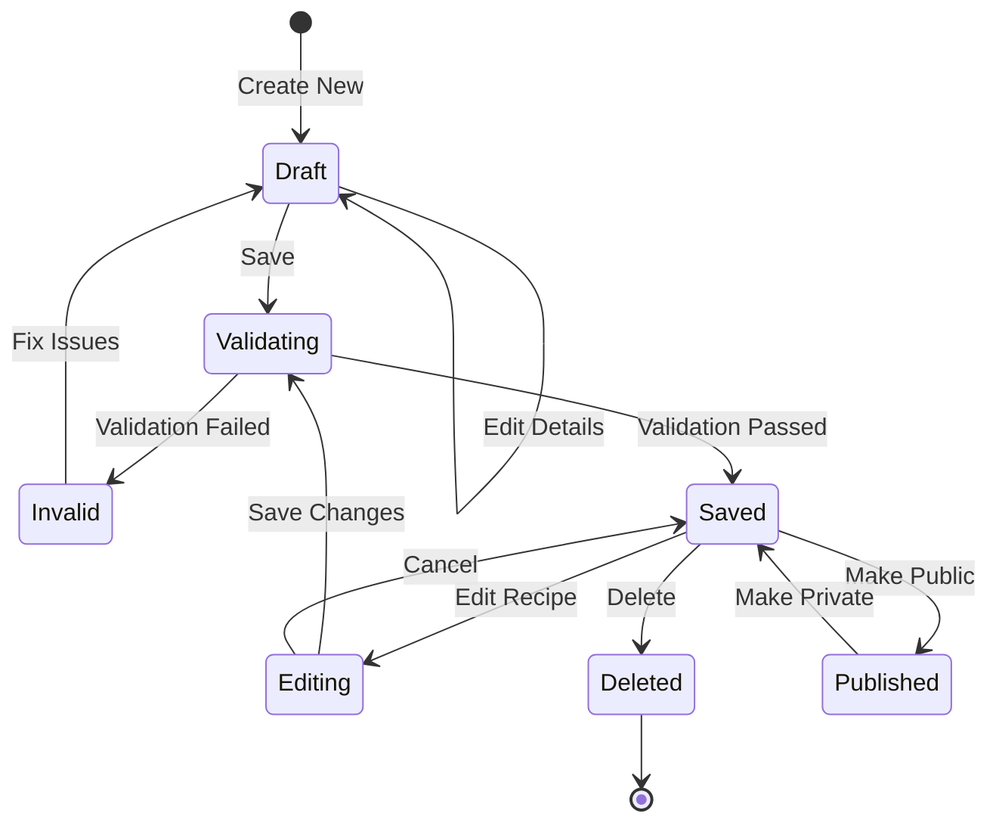

## Using Recipes for Tracking

### Adding Recipe to Daily Log

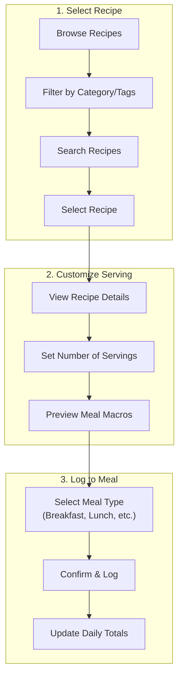

### Recipe to Meal Conversion

When a recipe is logged, it creates a meal with the recipe's ingredients:

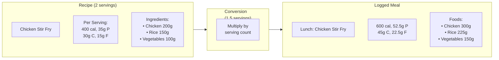

### Complete Tracking Flow Sequence

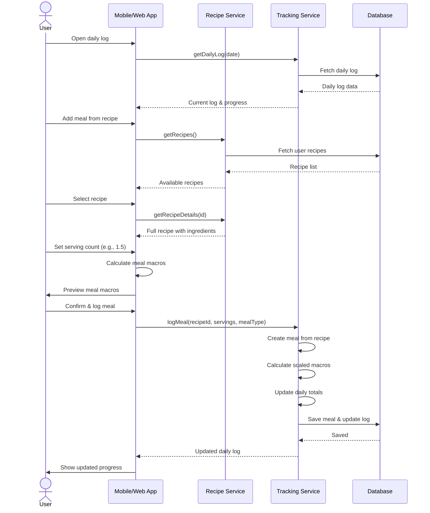

### Daily Log Update Process

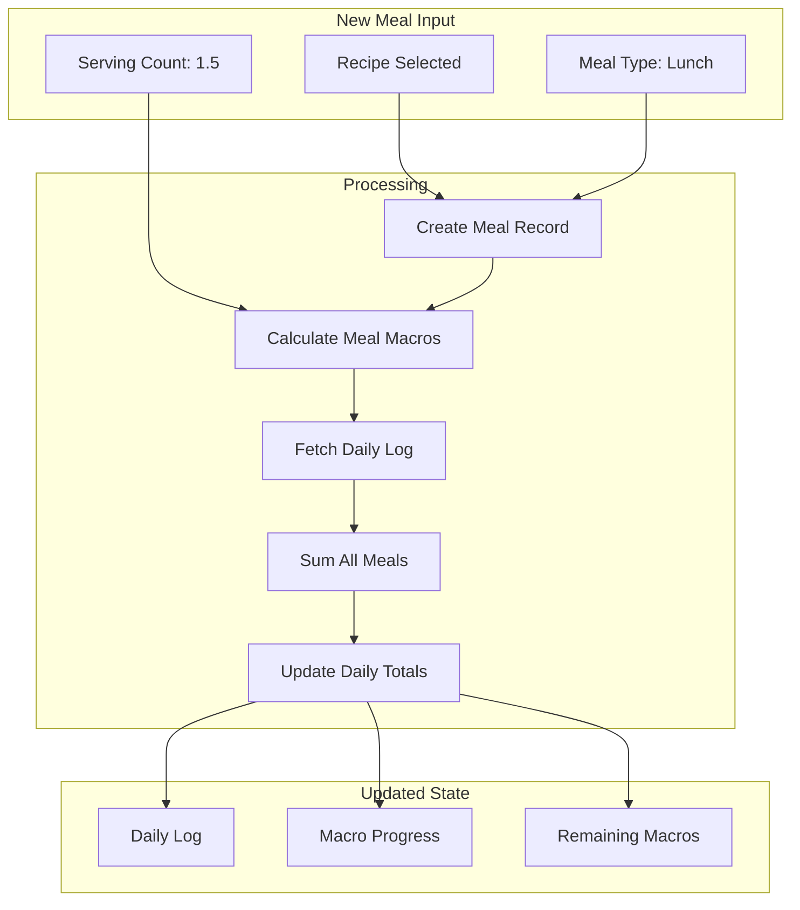

## Recipe Scaling

### Scaling Logic

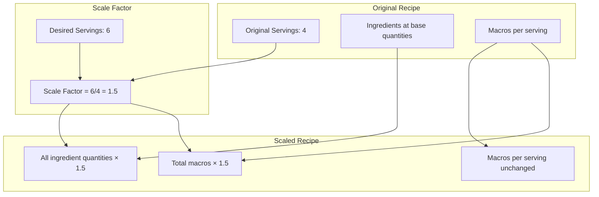

### Scaling for Meal Prep

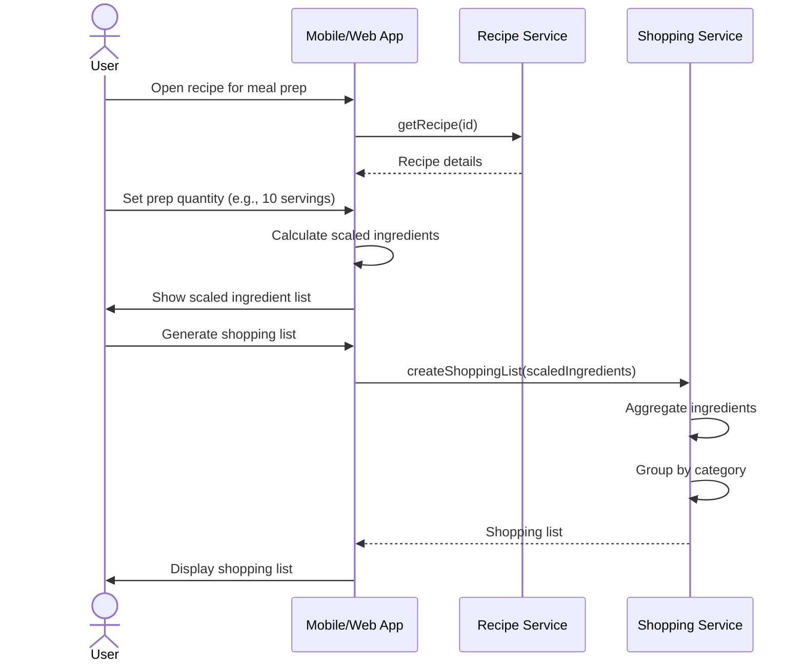

## Complete System Overview

### End-to-End Data Flow

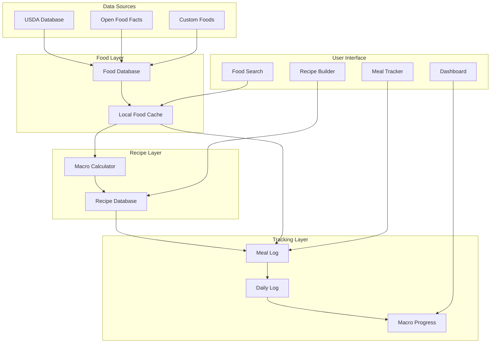

### User Journey Map

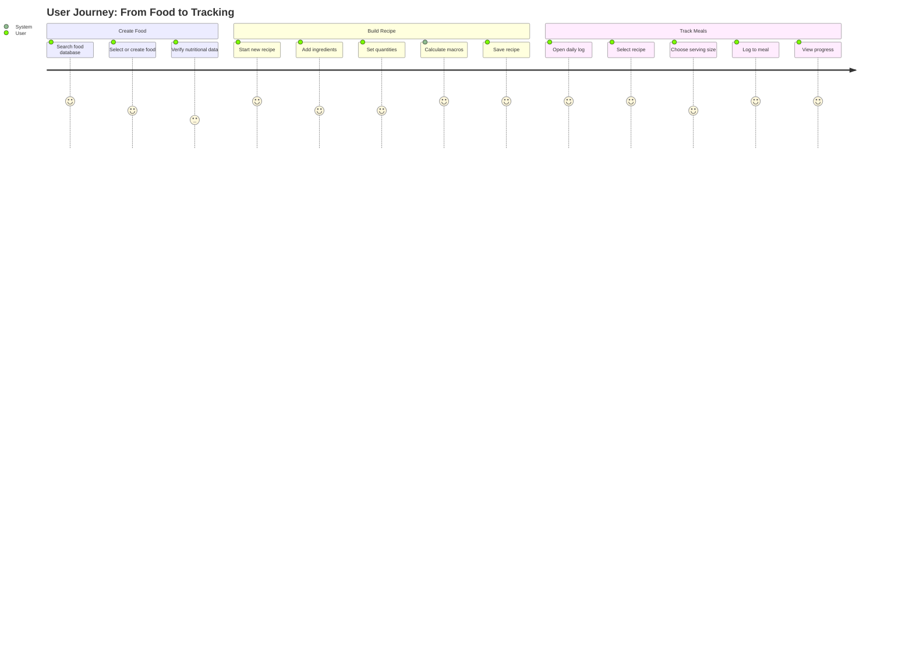

## API Endpoints

### Food Endpoints

| Method | Endpoint | Description |
|--------|----------|-------------|
| GET | `/foods/search?q={query}` | Search foods by name |
| GET | `/foods/barcode/{code}` | Lookup food by barcode |
| GET | `/foods/{id}` | Get food details |
| POST | `/foods` | Create custom food |
| PUT | `/foods/{id}` | Update custom food |
| DELETE | `/foods/{id}` | Delete custom food |

### Recipe Endpoints

| Method | Endpoint | Description |
|--------|----------|-------------|
| GET | `/recipes` | List user's recipes |
| GET | `/recipes/{id}` | Get recipe details |
| POST | `/recipes` | Create new recipe |
| PUT | `/recipes/{id}` | Update recipe |
| DELETE | `/recipes/{id}` | Delete recipe |
| POST | `/recipes/{id}/duplicate` | Duplicate recipe |
| GET | `/recipes/public` | Browse public recipes |

### Tracking Endpoints

| Method | Endpoint | Description |
|--------|----------|-------------|
| GET | `/logs/{date}` | Get daily log |
| POST | `/logs/{date}/meals` | Add meal to log |
| PUT | `/logs/{date}/meals/{mealId}` | Update meal |
| DELETE | `/logs/{date}/meals/{mealId}` | Remove meal |
| POST | `/logs/{date}/meals/from-recipe` | Create meal from recipe |

## Data Calculations

### Macro Calculation Formulas

**Food Macros (per quantity):**
```
macros = food.macros × (quantity / food.servingSize)
```

**Recipe Macros (per serving):**
```
totalMacros = Σ(ingredient.food.macros × ingredient.quantity)
perServingMacros = totalMacros / recipe.servings
```

**Meal Macros (from recipe):**
```
mealMacros = recipe.perServingMacros × servingCount
```

**Daily Totals:**
```
dailyTotalMacros = Σ(meal.macros) for all meals
progress = (dailyTotalMacros / targetMacros) × 100
remaining = targetMacros - dailyTotalMacros
```

## Error Handling

### Common Error States

```mermaid
flowchart TD
    subgraph FoodErrors["Food Errors"]
        FE1["Food not found"]
        FE2["Invalid barcode"]
        FE3["Duplicate food"]
        FE4["Invalid macro data"]
    end
    
    subgraph RecipeErrors["Recipe Errors"]
        RE1["No ingredients"]
        RE2["Invalid serving count"]
        RE3["Missing required fields"]
        RE4["Circular reference"]
    end
    
    subgraph TrackingErrors["Tracking Errors"]
        TE1["Recipe not found"]
        TE2["Invalid serving count"]
        TE3["Log not found"]
        TE4["Offline - queued"]
    end
    
    FE1 --> CreateCustom["Prompt: Create custom food"]
    FE2 --> ManualEntry["Prompt: Manual entry"]
    FE3 --> Merge["Prompt: Merge or keep separate"]
    FE4 --> Correct["Prompt: Correct values"]
    
    RE1 --> AddIngredient["Prompt: Add ingredients"]
    RE2 --> FixServings["Default to 1 serving"]
    RE3 --> ShowRequired["Highlight required fields"]
    RE4 --> Block["Block save"]
    
    TE1 --> RefreshRecipes["Refresh recipe list"]
    TE2 --> ResetServings["Reset to default"]
    TE3 --> CreateLog["Create new log"]
    TE4 --> QueueAction["Queue for sync"]
```

## Related Documentation

- [Data Models](./data-models.md) - Core entity definitions
- [User Stories: Meal Planning](./user-stories/meal-planning.md) - Recipe management user stories
- [User Stories: Core Tracking](./user-stories/core-tracking.md) - Meal logging user stories
- [Architecture](./architecture.md) - Technical architecture overview
